# Viikon 1 palautus

Viikon tehtävinä oli lukea ja tiivistää kaksi artikkelia muutaman ranskalaisen viivan avulla, asentaa Linux virtuaalikoneeseen sekä bonuksena tehdä ja raportoida jokin toimenpide haluamallani Linux-ohjelmalla.

---

## 1. Artikkelit

Artikkelit koskivat raportin kirjoittamista sekä Vapaata lähdekoodia liittyen annettuihin sivuihin.  
Raportin kirjoittamiseta koskeva materiaali: https://terokarvinen.com/2006/raportin-kirjoittaminen-4/  
Vapaata lähdekoodia koskeva materiaali: https://www.gnu.org/philosophy/free-sw.html

#### Raportin kirjoitus

Tärkeimmät asiat artikkelista olivat:

- Raportinnissa kerrotaan tarkasti mitä tehdään ja mitä sen jälkeen tapahtuu
- Suositeltua on kirjoittaa raporttia itse suorituksen yhteydessä
- Raportin on oltava
    - Toistettava - Samassa ympäristössä tulee sama lopputulos myös toisella käyttäjällä
    - Täsmällinen - Tarkat ohjeet siitä, mitä on tehty
    - Helppolukuinen - Hyvä ulkoasu, ei kirjoitusvirheitä
    - Lähteet huomioiva - Jos haet tietoa, merkkaa lähteet
    - Paikkaansa pitävä - Älä kerro tehneesi asioita, mitä et ole tehnyt

#### Vapaa lähdekoodi

Tärkeimmät asiat artikkelista olivat:

- abc
- abc

---

## 2. Linuxin asennus

Tehtävänä oli asentaa virtuaalikoneelle Linux ja raportoida eteneminen. Käytän asennuksessa kurssin opettajan Teron [ohjeita](https://terokarvinen.com/2021/install-debian-on-virtualbox/).

#### Oma kone

Suoritan asennuksen kannettavalla tietokoneella, joka pitää sisällään:

- Windows 11 Home
  - Versio: 23H2
- Nvidia rtx 2060 näytönohjain
- Intel i7-9750H prosessori
- 16Gb Ram
- 1100Gb tallennustilaa
  - Josta vapaana +700Gb

#### Asennuksen valmistelu

Asennan Linuxin virtuaalikoneeseen ja ennestään koneella oli jo asennettuna virtual box, mutta sitä käynnistäessä se tarjosi suoraan päivitysmahdollisuuden, joten aloitin virtual boxin päivityksellä sekä [debian-live-12.4.0-amd64-xfce.iso](https://cdimage.debian.org/debian-cd/current-live/amd64/iso-hybrid/) levykuvan latauksella.  
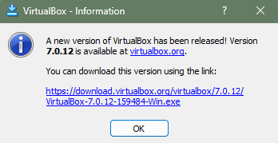

#### Tehdään uusi virtuaalikone

1. käynnistetään virtual box  
    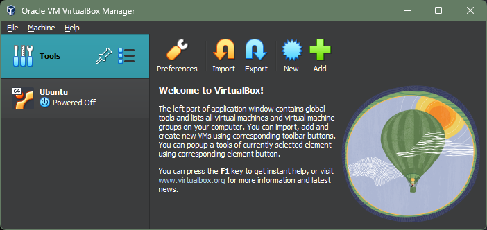
2. Painetaan painiketta `New`
3. Valitaan avautuneeta valikosta `Expert Mode`
4. Ikkunan `Name and Operating System` osiossa syötetään **Name**, **Folder**, **Type:Linux**, **Version: Debian(64-bit)**
5. `Unattended Install` osio on harmaana ja sinne ei tehdä muutoksia
6. `Hardware` osiosta **Base memory: 4000MB**, **Processors: 2**
7. `Hard Disk` osiosta valitaan **Create a Virtual Hard Disk Now**, asetetaan tallennustilan määräksi 40GB sekä **Hard Disk File Type and Variant** osion alasvetovalikosta valitaan **VDI (VirtualBox Disk Image)**
8. Painetaan `Finish`
   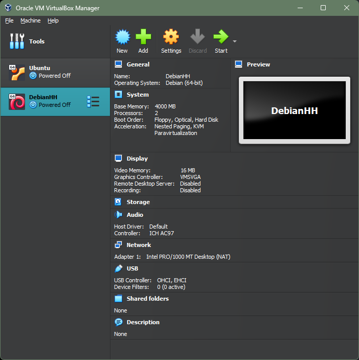
9. Valitaan **DebianHH** aktiiviseksi ja painetaan **Settings**
10. Avautuneesta ikkunasta valitaan **Storage** välilehti
11. Valitse **Controller: IDE** alapuolella oleva **Empty**  
    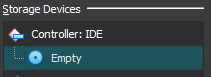
12. Paina **Attributes** osiosta oikealta pientä cd-levyn kuvaa ja valitse **Choose/Create a Virtual Optical Disk...**
13. Avautuneesta valikosta paina **Add** ja etsitään aikaisemmin ladattu Debianin levykuva, painetaan levykuva tiedostoa ja painetaan **Open**, **Choose** ja **OK**

#### Virtuaalikoneen käynnistys

1. Valitaan vasemmasta reunasta **DebianHH**
2. Painetaan **Start**(Vihreä nuoli) virtual boksissa
3. Virtuaalitietokone avaa oman ruudun
4. Valitaan **Live system(amd64)** painamalla **enter**
5. Odottelun jälkeen ollaan työpöydällä ja voit mennä vaikka internettiin:
   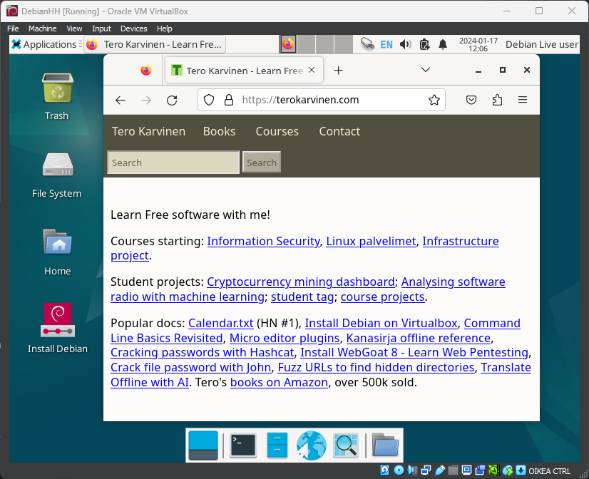

#### Debianin asennus virtuaalikoneelle

1. Painetaan virtuaalikoneen työpöydällä olevaa **Install Debian** painiketta, tässä kohtaa avautuu ikkuna, joka kertoo "Untrusted application launcherista", mutta tästä ei tarvitse tällä kertaa välittää, joten painetaan **Launch Anyway**
2. Valitaan kieli ja **Next**
3. Painetaan suomea kartalla ja sen jälkeen **Next**
4. Valitaan listalta **Finnish** ja kokeillaan, että ääkköset toimii jonka jälkeen **Next**
5. Kun osio näyttää alla olevan kuvan mukaiselta(_ei välttämättä tarvitse painaa mitään_), painetaan **Next**
   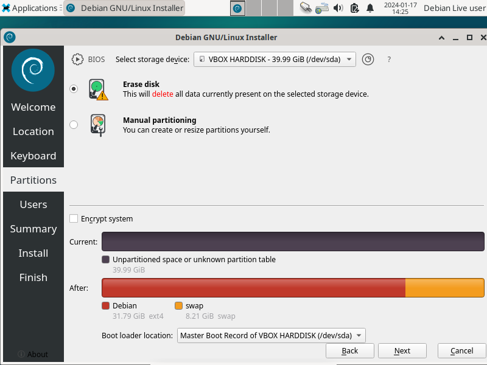
6. Syötetään tiedot: **Oma nimi**, **Tunnuksen nimi**, **Tietokoneen nimi** sekä **Vahva salasana** ja painetaan **Next**
7. Tarkistetaan yhteenvedosta tiedot ja painetaan **Install**. Jos et löydä painiketta, suurenna ikkuna oikeassa yläreunassa olevasta neliöstä, jolloin painike tulee näkyviin.  
   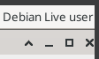
8. Odotellaan....järjstelmän.....asentumista...

#### Sisäänkirjautuminen

1. Painetaan Virtual Boxissa Start
2. Valikossa voidaan vain odottaa, jolloin homma jatkuu eteenpäin
3. Kirjaudutaan sisään aikaisemmin luodulla käyttäjätunnuksella ja salasanalla
4. Ollaan kirjauduttu sisään
   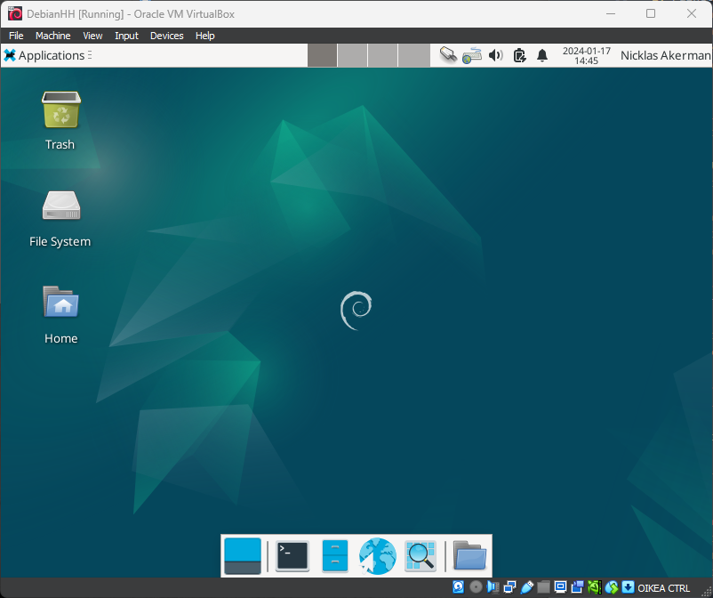

#### Resoluution vaihtaminen

1. Muutetaan resoluutiota valitsemalla yläreunasta **Devices** ja alasvetovalikosta valitaan **Insert Guest Additions CD image..**
2. Painetaan työpöydälle tullutta kuvaketta **VBOX_GAs_7..**
3. Painetaan vasemmasta yläreunasta **Applications** ja sieltä **Terminal emulator**
4. Syötetään terminaaliin komennot:
   `cd /media/*/VBox*`
   `ls`
   `sudo bash VBoxLinuxAdditions.run`
   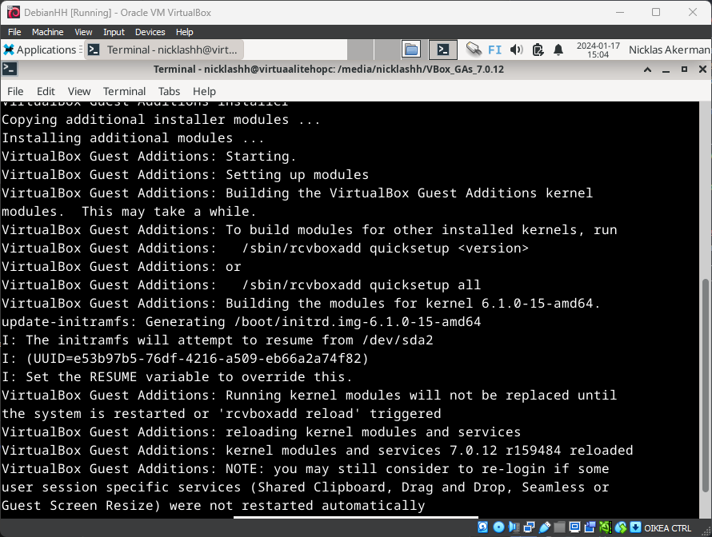
5. Kun terminaalin teksti ei enään päivity, voidaan valita oikeasta yläreunasta **Applications** -> **Log Out** -> **Restart**
6. Kirjaudutaan sisään ja kokeilaan, että resoluutiota voidaan vaihtaa vetämällä ikkunaa eri kokoiseksi
   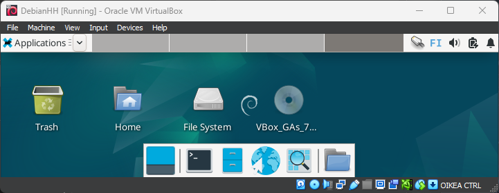

---

## 3. Linuxin testailua

1. Yksi hieno asia verrattuna windowsiin oli se, että kaiken saa päivitettyä kerralla komennolla:
   `sudo apt-get -y dist-upgrade`
   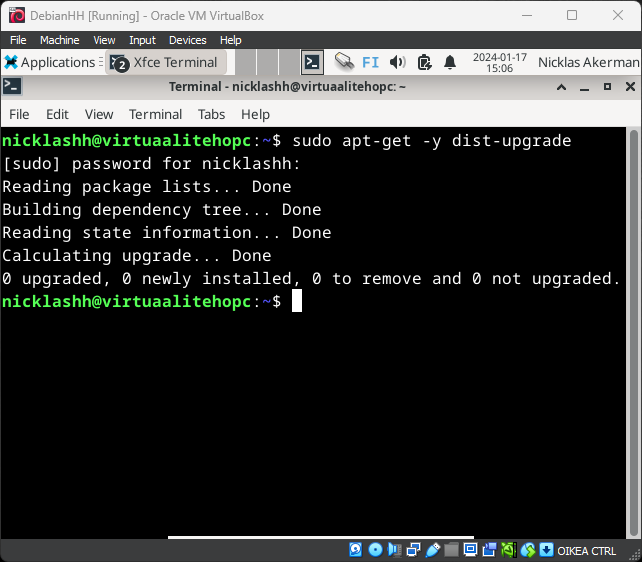
2. Print screen näppäintä painettaessa, on aika paljon enemmän ominaisuuksia kuin windowsin versiossa
   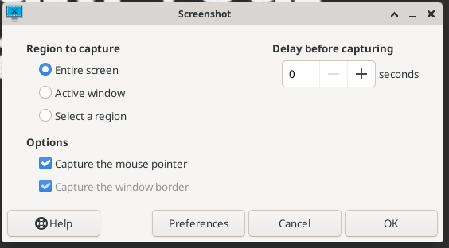
3. Terminaalin kautta saa luotua samalla tavalla kansioita kuin windowsissa, samaten pienellä testailulla liikkuminenkin onnistuu samoilla komennoilla.
   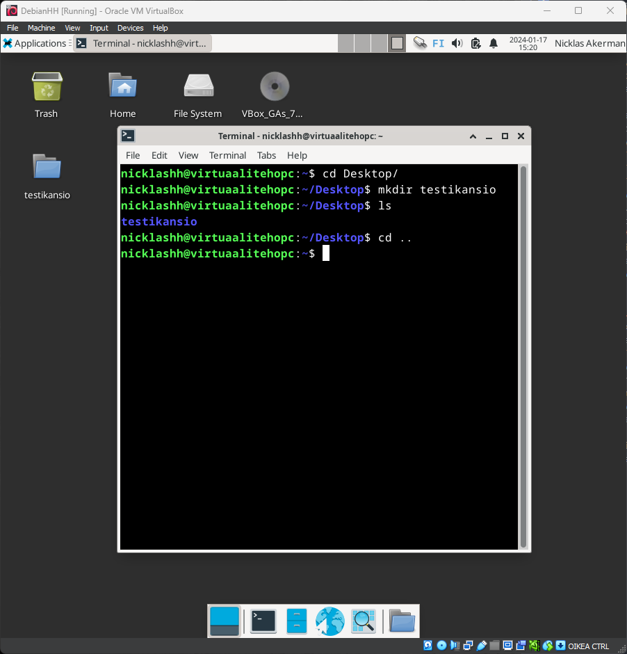

---

## Lähteet
Tero Karvinen - Install Debian on Virtualbox - Updated 2023  
https://terokarvinen.com/2021/install-debian-on-virtualbox/  

Tero Karvinen - Raportin kirjoittaminen  
https://terokarvinen.com/2006/raportin-kirjoittaminen-4/  

Tero Karvinen - Linux Palvelimet 2024 alkukevät  
https://terokarvinen.com/2024/linux-palvelimet-2024-alkukevat/  

What is Free Software?  
https://www.gnu.org/philosophy/free-sw.html  