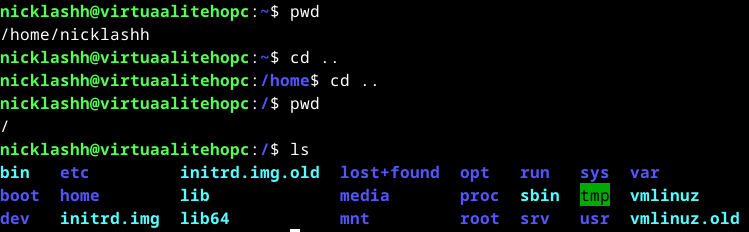
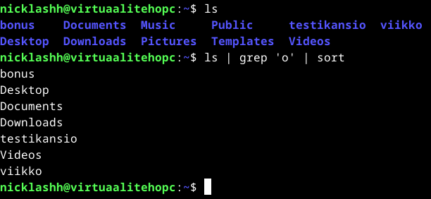

# Viikon 2 palautus

Alla on kerrottu viikon tehtävät. Ne toimivat samalla linkkinä kyseisen osioon tässä dokumentissa.

- x) [lukea ja tiivistää artikkeli muutaman ranskalaisen viivan avulla liittyen Linuxin komentoihin.](https://github.com/NicklasHH/Linux-palvelimet/blob/master/h2%20Komentaja%20Pingviini/Palautus2.md#x-artikkeli)
- a) [Asentaa micro-editori](https://github.com/NicklasHH/Linux-palvelimet/blob/master/h2%20Komentaja%20Pingviini/Palautus2.md#a-micro-editori)
- b) [Listata testaamani koneen rauta](https://github.com/NicklasHH/Linux-palvelimet/blob/master/h2%20Komentaja%20Pingviini/Palautus2.md#b-testikoneen-rauta)
- c) [Asentaa kolme komentoriviohjelmaa](https://github.com/NicklasHH/Linux-palvelimet/blob/master/h2%20Komentaja%20Pingviini/Palautus2.md#c-komentoriviohjelmat)
- d) [Esitellä tehtävänannossa määritellyt kansiot](https://github.com/NicklasHH/Linux-palvelimet/blob/master/h2%20Komentaja%20Pingviini/Palautus2.md#d-kansioiden-esittely)
- e) [Kuvata muutamalla kuvalla grep komennon käyttöä](https://github.com/NicklasHH/Linux-palvelimet/blob/master/h2%20Komentaja%20Pingviini/Palautus2.md#e-grep--komennon-k%C3%A4ytt%C3%B6esimerkit)
- f) [Näyttää esimerkki putkista](https://github.com/NicklasHH/Linux-palvelimet/blob/master/h2%20Komentaja%20Pingviini/Palautus2.md#f-putket)
- g) [Aiheuttaa lokiin tapahtumat onnistuneesta ja epäonnistuneesta/kielletystä toimenpiteestä](https://github.com/NicklasHH/Linux-palvelimet/blob/master/h2%20Komentaja%20Pingviini/Palautus2.md#g-lokitapahtumat)
  
Lisäksi alla vielä suorat linkit fyysisen koneen tietoihin sekä alkutilanteen kuvaukseen:
- [Fyysisen koneen tiedot](https://github.com/NicklasHH/Linux-palvelimet/blob/master/h2%20Komentaja%20Pingviini/Palautus2.md#fyysinen-tietokone)
- [Kuvailen alkutilanteen](https://github.com/NicklasHH/Linux-palvelimet/blob/master/h2%20Komentaja%20Pingviini/Palautus2.md#alku)

Osion lähteet: (Karvinen 2024.)

---

## x) Artikkeli

- Heti artikkelin alussa kerrotaan, että Linuxin komentorivi on selvinnyt ajasta hyvin: se oli olemassa ennen internetiä ja toimii edelleen tänäkin päivänä.
- Komentorivin hyödyiksi kuvaillaan sen olevan kätevä, nopea, ilmeikäs ja helppo automatisoida.
- Artikkeli käy läpi tärkeimpiä toimintoja seuraavassa järjestyksessä: - Kuinka liikutaan hakemistossa - Kuinka manipuloidaan tiedostoja - SSH etäohjaus - Kuinka saadaan manuaalit esiin - Komentokehotteen historian ja arvauksien hyödyntämisen - Tärkeimmät hakemistot - Admin komennot

Osion lähteet: (Karvinen 2020.)

---

## Fyysinen tietokone

- Windows 11 Home
  - Versio: 23H2
- Nvidia rtx 2060 näytönohjain
  - 6 GB muistia
- Intel i7-9750H prosessori
  - 6 ydintä
- 2 x 8GB Ram
- 1000 GB NVMe m.2 SSD
  - Josta vapaana +700Gb
- Viimeisimmät päivitykset ja ajurit asennettuna 24.1.2024

## Alku

Ennen kuin siirryin alempana olevien asennuksien, toimintojen ja tehtävien pariin, suoritin seuraavat vaiheet:

1. Käynnistin virtuaalikoneen
2. Käynnistin terminaalin vasemmasta yläreunasta painamalla `Applications` -> `Terminal Emulator`
3. Syötin terminaaliin komennon: `sudo apt-get update` ja annoin salasanan.
4. Muutaman sekunnin päästä terminaaliin tuli teksti `Reading package lists... Done`  
   

## a) Micro-editori

Osiossa dokumentoin micro-editorin asennuksen terminaalin kautta.

1. Lähtökohta osion jälkeen syötin seuraavan komennon: `sudo apt install micro`
2. Asennus vei muutaman sekunnin, jonka jälkeen tarkistin asennuksen onnistumisen testaamalla ohjelmaa. Siirryin tunnilla tehtyyn kissa.txt tiedostoon ja avasin tiedoston komennolla `micro kissa.txt`

- CTRL+S = tallennus
- CTRL+Q = Ohjelman sulkeminen

Osion lähteet: (Screenath 2023.)

---

## b) Testikoneen rauta

Osiossa dokumentoidaan ja listataan virtuaalikoneen rauta.

1. Yritin suorittaa tehtävänannossa annetun komennon `sudo lshw -short -sanitize` terminaalissa, mutta vastauksena tuli: "_sudo: lshw: command not found_" joten suoritin edellisestä osiosta tutun ohjelman asennuksen. Tässä tapauksessa oli selkeää, että minulta puuttui lshw, joten asennuksen komento oli: `sudo apt install lshw` ja asennus vei muutaman sekunnin.  
   

2. Suoritin komennon komennon `sudo lshw -short -sanitize` uudelleen ja nyt tuli testikoneen rauta listana:  
   

Ajamalla komennon: `man lshw` sain esille manuaalin joka kertoi, että lshw on työkalu laitteistokonfiguraation yksityiskohtaisen tiedon näyttämiseen. Alle olen listannut omia ajatuksia näytetyistä tiedoista:

- **H/W path** on laitteiston polku
- **Device** on itse laite
- **Class** on luokka, johon laite kuuluu
- **Description** on kuvaus laitteesta
- Käytössä on VirtualBox
- Muistin määrä: `4GB`(joka määriteltiin asennuksen yhteydessä, eli kyseessä siis virtuaalikoneen muisti, ei varsinaisen fyysisen koneen)
- Prosessorin tiedot
- Kiintolevyn koko: `42GB VBOX HARDDISK`(Joka määriteltiin asennuksen yhteydessä 40GB, eli kyseessä virtuaalikoneen tallennustila)
- Käytössä on monta erilaista input luokan laitetta, kuten näppäimistö ja kaiutin.

**-short** = Manuaalin mukaan -short komento tulostaa lyhyen laitepuun, joka näyttää laitteiston polut.  

**-sanitize** = Manuaalin mukaan -sanitize komento poistaa mahdolliset arkaluontoista tietoa sisältävät tulosteet, kunte IP-osoitteet ja sarjanumerot.  

Osion lähteet: (Karvinen 2024.)

---

## c) Komentoriviohjelmat

Tässä osiossa asensin kolme itselle vierasta komentoriviohjelmaa, joita myös testasin käytössä. Lopuksi poistin asennetut ohjelmat ja asensin ne yhden komennon avulla.

##### Ensimmäinen ohjelma - cowsay

Idea tähän ohjelmaan tuli siitä, että tunnilla opettaja käyttää tätä kertomaan, milloin palataan tauolta eli kyseessä siis **cowsay**

1. Kirjoitin terminaaliin asennuskomennon `sudo apt install cowsay` ja asennus oli ohi muutamassa sekunnissa.
2. Kirjoitin terminaaliin `cowsay "testitapaus"` ja alle tulostui seuraava:  
   
3. Kokeilin vielä erilaista kuvaa komennolla: `cowsay -f tux "testataan toista eläintä"`  
   
4. Onnistuneen ja testatun asennuksen jälkeen poistin ohjelman, jotta voin myöhemmin kokeilla kaikkien kolmen ohjelman asentamista yhdellä komennolla. Poistokomento oli: `sudo apt-get remove cowsay` ja muutaman sekunnin päästä kysyttiin, haluanko poistaa asennuksen, johon vastasin kirjaimella `y` eli yes ja poisto oli tehty.

Osion lähteet: (Watking 2021.)

##### Toinen ohjelma

Toinen ohjelma jonka asensin on "hauska" ohjelma tapauksiin, jos kirjoitat vahingossa `ls` sijaan `sl`.

1. Kirjoitin terminaaliin asennuskomennon `sudo apt-get install sl` ja asennus oli ohi muutamassa sekunnissa.
2. Asennuksen onnistumisen jälkeen kirjoitin terminaaliin komennon `sl` ja juna ajelee terminaalissa, joten asennuksen onnistuminen on varmistettu.  
   
3. Viimeisenä vaiheena poistin asennetun ohjelman myöhempänä toteutettavan "Kolme asennusta kerralla" osion takia komennolla: `sudo apt-get remove sl`. Jo Ylempänä mainittu `y` painetaan, kun tulee kysymys "halutaanko ohjelma poistaa".

Osion lähteet: (Singh 2023.)

##### Kolmas ohjelma

Kolmantena ohjelmana asensin terminaaliin matopelin.

1. Kirjoitin terminaaliin asennuskomennon `sudo apt-get install nsnake` ja asennus oli jälleen ohi muutamassa sekunnissa.
2. Terminaaliin komento `nsnake` avaa pelin, jonka jälkeen sitä pystyi pelaamaan. Näppäin `Q` sulki pelin.  
   
3. Viimeisenä vaiheena taas poistin asennuksen komennolla `sudo apt-get remove nsnake` samalla tavalla kuin ylempänä olevissa ohjeissa.

Osion lähteet: (Singh 2023.)

##### Kaikki ohjelmat kerralla

Koska Debian tai Linux ylipäätään ei ollut kovin tuttu, lähdin suoraan tutkimaan Googlen vastauksia kysymykseen `how to install multiple programs at once debian` ja valitsin sivuston nimen perusteella vaihtoehdon, joka ohjasi sivustolle `linuxhint.com`, joka tarjosi suoraan vaihtoehdon, kuinka voin toteuttaa haluamieni kolmen asennuksen yhdellä komennolla.

1. Terminaalissa suoritin komennon `sudo apt-get install cowsay sl nsnake`
2. Muutaman sekunnin ajan terminaalissa liikkui teksti ja sen jälkeen testasin, toimiiko kaikki kolme ohjelmaa.

Cowsay:  
 

Sl eli juna:  
 

Matopeli eli nsnake:  
 

3. Kuten yllä olevista kuvista näkyy, kaikki kolme ohjelmaa saatiin asennettua yhden komennon avulla.

Osion lähteet: (Rehman 2023.)

---

## d) Kansioiden esittely

Tässä osiossa näytän kuvankaappauksin, kuinka käyn jokaisessa kansiossa, jotka on kuvattu Teron `Command Line Basics Revisited` sivuston `Important directories" osiossa`. En aivan ymmärtänyt tehtävänantoa, joten kuvankaappauksesta selviää aina lähtötilanne, sekä kuinka kansioon on päästy ja mitä kansio sisältää.

1. Kansio: `/` ja sen sisältö:  
   

2. Kansio: `/home/` ja sen sisältö:  
   

3. Kansio: `/home/nicklashh/` ja sen sisältö:  
   

4. Kansio: `/etc/` ja sen sisältö:  
   

5. Kansio: `/media/` ja sen sisältö:  
   

6. Kansio: `/var/log/` ja sen sisältö:  
   

Osion lähteet: (Karvinen 2020.)

---

## e) Grep -komennon käyttöesimerkit

Tässä osiossa käytin Jori Mäntysalon kirjoittamaa julkaisua, jossa on kerrotty grepin käytöstä suomeksi. (Mäntysalo 2004.)

1. Tein kansion nimeltä `testikansio` johon tein testi.txt tiedoston joka sisälsi muutamia sanoja.  
   

2. Testikansiossa ollessani kirjoitin komennon `grep 'tässä' teksti.txt` jolloin sain vastauksena kaikki ne rivit, joissa oli sana "tässä"
   

3. Testikansiossa ollessani kirjoitin komennon `grep -H 'tässä' teksti.txt` jolloin sain vastauksena kaikki ne rivit, joissa oli sana "tässä" sillä lisäyksellä edelliseen, että nyt tulostettiin myös kansion nimi.
   

4. Tein vielä toisen tiedoston, jonka lisäsin grep hakuun: `grep 'tässä' teksti.txt teksti2.txt`
   

Yhteenvetona voisi todeta, että grep haku siis on loistava, jos täytyy hakea vaikka useammasta tiedostosta tiettyä tekstisisältöä.

Osion lähteet: (Mäntysalo 2024.)

---

## f) Putket

Putkituksen avulla saadaan siirrettyä tuloste suoraan toiselle komennolle. Esimerkiksi tässä esimerkissä listasin kaikki kansiot `ls` komennolla, joka meni suoraan greppiin ja suodatti sieltä pois kaikki kansiot, jotka eivät sisällä kirjainta 'o' ja tämän jälkeen järjesti ne aakkosjärjestykseen. Kaikki tämä tapahtui komennolla: `ls | grep 'o' | sort`

Lyhykäisyydessään tuloste siis siirtyi esimerkissäni näin:

1. ls
   - listaa kansiot
2. listatut kansiot menee greppiin
   - kansiot jotka sisältävät o kirjaimen jatkaa matkaa
3. sort
   - grepin jälkeen jäljellä olevat kansiot järjestetään aakkosjärjestykseen

Osion lähteet: (Geeksforgeeks 2023.)

---

## g) Lokitapahtumat

Komennolla `man journalctl` sain selville, että journalctl mahdollistaa tapahtumalokien tarkastelun. Kun komento on `journalctl -f` näyttää loki viimeisimmät tapahtumat. Tässä osiossa oli suuria vaikeuksia selvittää tiettyjen osioiden tarkoitus ja osan tarkoitus jäikin pimentoon.

#### Onnistunut tapahtuma
kirjoitin komennon `sudo journalctl` ja annoin oikean salasanan, jolloin logiin tuli seuraavat viestit:
>Viesti 1.
>`tammi 24 16:43:47 virtuaalitehopc sudo[5311]: nicklashh : TTY=pts/0 ; PWD=/home/nicklashh ; USER=root ; COMMAND=/usr/bin/journalctl`
>  
>Viesti 2.
>`tammi 24 16:43:47 virtuaalitehopc sudo[5311]: pam_unix(sudo:session): session opened for user root(uid=0) by (uid=1000)`

##### Viestin analysointi
Viesti 1.
1. `tammi 24 16:43:47` = Tapahtuma-aika
2. `virtuaalitehopc` = Tietokoneen nimi
3. `sudo[5311]` = sudo komento ja prosessin ID
4. `nicklashh` = Komennon antaja
5. `TTY=pts/0` = *Ei tietoa*
6. `PWD=/home/nicklashh` = Mistä hakemistosta komento annettiin
7. `USER=root` = Käyttöoikeudet
8. `COMMAND=/usr/bin/journalctl` = Suoritettu komento/ohjelma

Viesti 2.
1. `tammi 24 16:43:47` = Tapahtuma-aika
2. `virtuaalitehopc` = Tietokoneen nimi
3. `sudo[5311]` = sudo komento ja prosessin ID
4. `pam_unix(sudo:session): session opened for user root(uid=0) by (uid=1000)` = Uusi istunto avattu käyttäjänumerolle 0 käyttäjänumeron 1000 toimesta

#### Epäonnistunut tapahtuma
kirjoitin komennon `sudo journalctl` ja annoin väärän salasanan, jolloin logiin tuli seuraava virheviesti:

>`tammi 24 16:41:44 virtuaalitehopc sudo[5311]: pam_unix(sudo:auth): authentication failure; logname= uid=1000 euid=0 tty=/dev/pts/0 ruser=nicklashh rhost=  user=nicklashh`

##### Viestin analysointi
1. `tammi 24 16:41:44` = Tapahtuma-aika
2. `virtuaalitehopc` = Tietokoneen nimi
3. `sudo[5311]: pam_unix(sudo:auth): authentication failure;` = Autentikointi ei mennyt läpi
4. `logname=` = *Ei tietoa*
5. `uid=1000` = user id
5. `euid=0` = Effective User Identifer (Määrittää käyttäjän oikeudet tehtäväkohtaisesti.)
6. `tty=/dev/pts/0` = *Ei tietoa*
7. `ruser=nicklashh` = Real User id (Todellinen käyttäjätunnus)
8. `rhost=` = Remote host
9. `user=nicklashh` = Käyttäjä

Osion lähteet: (Baeldung 2022, Geeksforgeeks 2021, Mckay 2023, )

---

## Lähteet

Baeldung 2022. What Do Identifiers Mean in Linux?: https://www.baeldung.com/linux/identifiers. Luettu: 24.1.2024.

Geeksforgeeks 2021. Real, Effective and Saved UserID in Linux. Luettavissa: https://www.geeksforgeeks.org/real-effective-and-saved-userid-in-linux/. Luettu: 24.1.2024.

Geeksforgeeks 2023. Piping in Unix or Linux. Luettavissa: https://www.geeksforgeeks.org/piping-in-unix-or-linux/. Luettu: 24.1.2024.

Karvinen, T. 2008. Commands for Admin. Luettavissa: https://terokarvinen.com/2008/commands-for-admin-4/. Luettu: 24.1.2024.

Karvinen, T. 2020. Command Line Basics Revisited. Luettavissa: https://terokarvinen.com/2020/command-line-basics-revisited/?fromSearch=command%20line%20basics%20revisited. Luettu: 24.1.2024.

Karvinen, T. 2024. Linux Palvelimet 2024 alkukevät. Luettavissa: https://terokarvinen.com/2024/linux-palvelimet-2024-alkukevat/. Luettu: 24.1.2024.

Mckay, D. 2023. How to Use journalctl to Read Linux System Logs. Luettavissa: https://www.howtogeek.com/499623/how-to-use-journalctl-to-read-linux-system-logs/. Luettu. 24.1.2024.

Mäntysalo, J. 2004. grep -komento ja säännölliset lausekkeet. Luettavissa: https://homepages.tuni.fi/jori.mantysalo/jutut/unix/grep.html. Luettu: 24.1.2024.

Rehman, Z. 2023. How to Use apt to Install Multiple Programs from the Command Line in Debian 11. Luettavissa: https://linuxhint.com/use-apt-to-install-multiple-programs-from-command-line-debian/. Luettu: 24.1.2024.

Screenath 2023. Micro: Making File Editing Easier in Linux Terminal. Luettavissa: https://itsfoss.com/micro-editor-linux/. Luettu: 24.1.2024.

Singh, G. 2023. 15 Fun Linux Command Line Programs to Spice Up Your Terminal. Luettavissa: https://medium.com/@gurpreet.singh_89/15-fun-linux-command-line-programs-to-spice-up-your-terminal-abf30af73de1. Luettu: 24.1.2024.

Watkins, D. 2021. 3 interesting ways to use the Linux cowsay command. Luettavissa: https://opensource.com/article/21/11/linux-cowsay-command. Luettu: 24.1.2024.