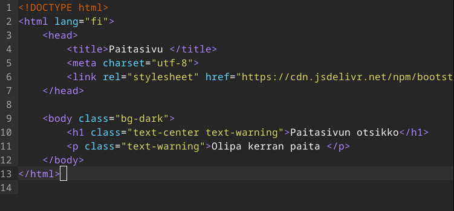

# Viikon 3 palautus

Alla on kerrottu viikon tehtävät. Ne toimivat samalla linkkinä kyseisen osioon tässä dokumentissa.

- x)[ Lukea ja tiivistää muutamien ranskalaisten viivojen avulla kaksi artikkelia liittyen Apacheen.](https://github.com/NicklasHH/Linux-palvelimet/blob/master/h3%20Hello%20Web%20Server/Palautus3.md#x-apache-artikkelit)
- a)[ Testata, että weppipalvelin vastaa localhost-osoitteesta.](https://github.com/NicklasHH/Linux-palvelimet/blob/master/h3%20Hello%20Web%20Server/Palautus3.md#a-weppipalvelimen-testaus)
- b)[ Etsiä ja analysoida lokista rivit, jotka syntyvät kun palvelimelta ladataan sivu.](https://github.com/NicklasHH/Linux-palvelimet/blob/master/h3%20Hello%20Web%20Server/Palautus3.md#b-lokien-analysointi)
- c)[ Tehdä uusi etusivu.](https://github.com/NicklasHH/Linux-palvelimet/blob/master/h3%20Hello%20Web%20Server/Palautus3.md#c-uusi-etusivu)
- e)[ Tehdä validi HTML5 sivu.](https://github.com/NicklasHH/Linux-palvelimet/blob/master/h3%20Hello%20Web%20Server/Palautus3.md#e-validi-html5-sivu)
- f)[ Curl komentojen esimerkit](https://github.com/NicklasHH/Linux-palvelimet/blob/master/h3%20Hello%20Web%20Server/Palautus3.md#f-curl--komennot)
- m)[ Hankkia GitHub Education -paketti.](https://github.com/NicklasHH/Linux-palvelimet/blob/master/h3%20Hello%20Web%20Server/Palautus3.md#m-github-education--paketin-hankinta)
- n)[ Tehdä Apachelle nimipohjainen virtuaalipalvelu](https://github.com/NicklasHH/Linux-palvelimet/blob/master/h3%20Hello%20Web%20Server/Palautus3.md#n--o-apachen-nimipohjainen-virtuaalipalvelu)
- o)[ Laittaa sama tietokone vastaamaan kahdelta eri sivulta kahdesta eri nimestä.](https://github.com/NicklasHH/Linux-palvelimet/blob/master/h3%20Hello%20Web%20Server/Palautus3.md#n--o-apachen-nimipohjainen-virtuaalipalvelu)   

Lisäksi alla vielä suorat linkit fyysisen koneen tietoihin sekä alkutilanteen kuvaukseen:

- [Fyysisen koneen tiedot](https://github.com/NicklasHH/Linux-palvelimet/blob/master/h3%20Hello%20Web%20Server/Palautus3.md#fyysinen-tietokone)
- [Kuvailen alkutilanteen](https://github.com/NicklasHH/Linux-palvelimet/blob/master/h3%20Hello%20Web%20Server/Palautus3.md#alku)

Osion lähteet: (Karvinen 2024.)

---

## Fyysinen tietokone

- Windows 11 Home
  - Versio: 23H2
- Nvidia rtx 2060 näytönohjain
  - 6 GB muistia
- Intel i7-9750H prosessori
  - 6 ydintä
- 2 x 8GB Ram
- 1000 GB NVMe m.2 SSD
  - Josta vapaana +700Gb
- Viimeisimmät päivitykset ja ajurit asennettuna 31.1.2024

---

## Alku

Ennen kuin siirryin alempana olevien asennuksien, toimintojen ja tehtävien pariin, suoritin seuraavat vaiheet:

1. Käynnistin virtuaalikoneen
2. Käynnistin terminaalin vasemmasta yläreunasta painamalla `Applications` -> `Terminal Emulator`
3. Syötin terminaaliin komennon: `sudo apt-get update` ja annoin salasanan.
4. Muutaman sekunnin päästä terminaaliin tuli teksti `Reading package lists... Done`  
   

---

## x) Apache artikkelit

#### Apachen artikkeli

Name-based Virtual Host Support -artikkelin tiivistys:

- Artikkelissa käydään läpi, kuinka käytetään nimiin perustuvia virtuaalipalvelimia.
- Artikkelissa perehdytään kolmeen eri osa-alueeseen:

1. Nimipohjaiset vs. IP-pohjaiset Virtuaalipalvelimet
   - IP-pohjaiset virtuaalipalvelimet käyttävät IP-osoitetta jolla määritellään oikea palvelin.
   - Nimipohjaiset virtuaalipalvelimet perustuvat siihen, että asiakas ilmoittaa verkkotunnuksen HTTP-otsikossa, jonka avulla monta palvelinta voi jakaa saman IP-osoitteen.
2. Kuinka palvelin valitsee oikean nimipohjaisen virtuaalipalvelimen
   - Pyynnön saapuessa palvelin löytää parhaan vastaavan <VirtualHost>-argumentin pyynnössä käytetyn IP-osoitteen ja portin perusteella. Jos on olemassa enemmän kuin yksi virtuaalinen isäntä, joka sisältää saman osoitteen ja portin yhdistelmän, Apache vertaa edelleen ServerName- ja ServerAlias-direktiivejä pyynnössä olevaan palvelimen nimeen.
3. Nimipohjaisten Virtuaalipalvelimien Käyttö
   - Nimipohjaisen virtuaalipalvelimen käyttö voidaan määritellä esimerkiksi `httpd.conf` tiedostossa

#### Teron artikkeli

Name Based Virtual Hosts on Apache – Multiple Websites to Single IP Address -artikkelin tiivistys:

- Apachen avulla saadaan käyttöön monta verkkotunnusta yhdelle IP osoitteelle.
- Oikeassa elämässä vuokrataan nimet palveluntarjoajilta, mutta tässä nimensiirtoa simuloidaan paikallisesti.

Tämän jälkeen käydään läpi kuinka tämä tapahtuu seuraavassa järjestyksessä:

1. Kuinka asennetaan ja määritellään web-palvelin
2. Kuinka lisätään uusi nimipohjainen virtuaalihosti
3. Kuinka luodaan verkkosivu ilman sudo oikeuksia
4. Testausosio

Osion lähteet: (Apache 2023, Karvinen 2018.)

---

## a) Weppipalvelimen testaus

Tunnilla asennettiin jo Apachen palvelin, joten täsä osiossa vain testataan, että se vastaa localhost osoitteesta. Tässä huomio, että koska käytössä on portti 80, tulee osoite olla muotoa `http://localhost/`, eli S otetaan pois http osasta, joka sinne automaattisesti usein tulee.

   

Näin on testattu, että localhost vastaa ja Apachen palvelin on asennettu onnistuneesti.

---

## b) Lokien analysointi

Hain lokitiedon seuraavalla komennolla: `sudo tail -1 /var/log/apache2/access.log` ja sain vastauksena lokitiedot, jotka eivät päivittyneet kun päivitin localhostin. Tutkin `/var/log/apache2/` polkua ja en päässyt sinne ollenkaan vajaavaisten käyttöoikeuksien takia. Siirryin komennolla `cd /var/log/` ja suoritin komennon `ls apache2/` josta sain tiedon, että se sisältää kansiot:

- access.log
- error.log
- other_vhosts_access.log

Testasin ensin komennolla `sudo tail -1 /var/log/apache2/error.log` ja edelleen mitään ei näkynyt, joten testasin vielä viimeisen komennolla `sudo tail -1 /var/log/apache2/other_vhosts_access.log` ja vihdoin alkoi näkymään reaaliaikaisesti uusi rivi lokissa, kun päivitän localhost sivun:

> `127.0.1.1:80 127.0.0.1 - - [31/Jan/2024:11:53:18 +0200] "GET / HTTP/1.1" 200 473 "-" "Mozilla/5.0 (X11; Linux x86_64; rv:109.0) Gecko/20100101 Firefox/115.0"`

Vihdoin päästään analysoimaan lokia:  
**127.0.1.1:80** = Lähteen ip ja portti  
**127.0.0.1** = Pyynnön tekijän IP osoite  
**[31/Jan/2024:11:53:18 +0200]** = Aika milloin pyyntö tehtiin  
**"GET / HTTP/1.1"** = Pyynnon tyyppi ja pyydettävä resurssi  
**200** = HTTP vastauskoodi  
**473** = Palautuksen koko  
**"Mozilla/5.0 (X11; Linux x86_64; rv:109.0) Gecko/20100101 Firefox/115.0"** = Käyttäjäagentti, joka tunnistaa tiedot selaimesta

Osion lähteet: (Karvinen 2018, Fitzpatrick 2020.)

---

## c) Uusi etusivu

1. Aloitan luomalla kansioon `/home/nicklashh/publicsites` uuden kansion komennolla `mkdir hattu.example.com` ja teen sinne index.html tiedoston `micro hattu.example.com/index.html`

2. Kirjoitin index.html tiedostoon seuraavan tekstin, joka ottaa käyttöön html5, asettaa sivuston otsikoksi "Hattusivu" ja ottaa käyttöön utf-8. Lisäksi tässä on määritelty Body, minkä sisään tulee H1 otsikko sekä teksti.
   

3. Siirryin komennolla `cd /etc/apache2/sites-available/` oikeaan polkuun, jonne kirjoitin komennon `sudoedit /etc/apache2/sites-available/hattu.example.com.conf` ja kirjoitin seuraavat:
   

4. Seuraavaksi kirjoitin polussa `/etc/apache2/sites-available` tunnilta tutut komennot:

- sudo a2ensite hattu.example.com
- sudo a2dissite testi.example.com
- sudo systemctl restart apache2

5. Tarkistetaan muutokset selaimella:
   

Osion lähteet: (Karvinen 2018.)

---

## e) Validi HTML5 sivu

Osiossa C tein jo HTML5 sivun sen ollessa tuttua, joten voidaan varmistaa sen validius antamalla tehty koodi W3 validatoriin.

   
 
Tästä huomataan, että html tagista puuttuu sulku, joten korjataan se, sekä html tagin sisään lang="fi", jolloin saadaan myös varoitus pois.

   
 

Lisäsin vielä sivustolle hieman muotoilua, jonka jälkeen vielä tarkistin W3 validaattorilla, ettei virheitä tule ja tässä lopputulos sivusta:

   

Osion lähteet: (W3.)

---

## f) Curl -komennot

#### curl
Komento `curl [url]` palauttaa oman manuaalinsa mukaan ilman lisäkomentoja verkkosivulta saadun datan/html sivun. Tässä esimerkissä käytetty komentoa `curl localhost`
   

#### curl -I
Komento `curl -I [url]` tekee vain HEAD pyynnön, eli palautuksena tulee sivuston kaikki Headerit.
   

- **Date** = Sisältää viestin alkuperäisajankohdan ja -päivämäärän
- **Server** = Sisältää tiedot siitä ohjelmistosta, jota alkuperäispalvelin käyttää pyynnön käsittelyyn
- **Last-Modified** = Resurssin viimeisin muokkauspäivämäärä
- **ETag** = Uniikki merkkijono, joka tunnistaa resurssin version
- **Content-Length** = Resurssin koko, desimaalilukuna tavuina ilmaistuna
- **Vary** = Määrittää, miten otsikoita sovitetaan yhteen, jotta voidaan päättää, voiko välimuistissa olevaa vastausta käyttää sen sijaan, että pyydettäisiin tuoretta vastausta alkuperäiseltä palvelimelta.
- **Content-Type** = Määrittelee resurssin sisällön tyypit

Osion lähteet: (Mozilla 2023)
Osion lähteenä käytetty myös Curlin manuaalia komennolla `man curl`

---

## m) GitHub Education -paketin hankinta

Osion tarkoituksena on hankkia Githubin education paketti, joka lähtee liikkeelle osoitteessa https://education.github.com/.

1. Klikkasin `Join Global Campus >`
2. Klikkasin `Yes, I´m a student`
3. Valitsin `Student` ja vieritin alareunaan jossa painoin `Continue`(Minulla oli valmiiksi koulun sähköposti ja koulu asetettuna)
4. Latasin pakin kautta opiskelutodistus englanniksi
5. Latasin opiskelutodistuksesta otetun kuvan 
6. Odotellaan, kunnes tulee vastaus sähköpostiin.
   

Osion lähteet: (Github 2024.)

---

## n) + o) Apachen nimipohjainen virtuaalipalvelu
Tein molemmat tehtävät samaan aikaan soveltaen Teron ohjeita artikkelista "Name Based Virtual Hosts on Apache – Multiple Websites to Single IP Address" seuraavasti:

1. Polussa `/home/nicklashh/publicsites` tein uuden kansion komennolla `mkdir paita.example.com` 
2. Tein tiedoston komennolla `micro paita.example.com/index.html` ja kopioin sinne lähes saman tekstin kuin aikaisemmin tehty index.html hattu osiossa:
   
3. Komennolla `sudoedit /etc/apache2/sites-available/paita.example.com.conf` tehtiin uusi konfiguraatio paita sivustoa varten ja kun tiedosto oli valmis ja suljettu, otettiin se aktiiviseksi komennolla `sudo a2ensite paita.example.com` ja käynnistettiin Apache uusiksi komennolla `sudo systemctl restart apache2`
   

4. Viimeisenä vaiheena tuli muokata /etc/hosts tiedostoa komennolla `sudoedit /etc/hosts` niin, että sinne lisättiin sekä paita.example.com sekä hattu.example.com.
   

5. Testataan että seuraavat sivut toimivat
- localhost
- hattu.example.com
- paita.example.com

   

Osion lähteet: (Karvinen 2018)

---

## Lähteet

Apache 2023. Name-based Virtual Host Support. Luettavissa: https://httpd.apache.org/docs/2.4/vhosts/name-based.html. Luettu: 31.1.2024.

Fitzpatrick, S. 2020. Understanding the Apache Access Log: View, Locate and Analyze. Luettavissa: https://www.sumologic.com/blog/apache-access-log/. Luettu: 31.1.2024.

GitHub 2024. Where future developers meet. Luettavissa: https://education.github.com/. Luettu: 31.1.2024.

Karvinen, T. 2018. Name Based Virtual Hosts on Apache – Multiple Websites to Single IP Address. Luettavissa: https://terokarvinen.com/2018/04/10/name-based-virtual-hosts-on-apache-multiple-websites-to-single-ip-address/. Luettu: 31.1.2024.

Karvinen, T. 2024. Linux Palvelimet 2024 alkukevät. Luettavissa: https://terokarvinen.com/2024/linux-palvelimet-2024-alkukevat/. Luettu: 31.1.2024.

Mozilla 2023. HTTP headers. Luettavissa: https://developer.mozilla.org/en-US/docs/Web/HTTP/Headers. Luettu: 31.1.2024.

W3. Validate by Direct Input. Luettavissa: https://validator.w3.org/#validate_by_input. Luettu: 31.1.2024.