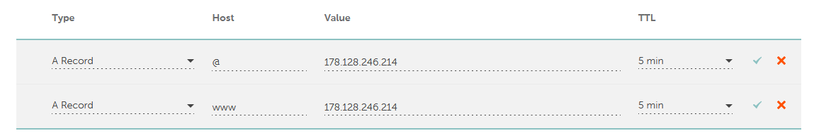

# Viikon 4 palautus

Viikon 4 tehtävät olivat seuraavat:

- x)[ Lukea ja tiivistää muutamien ranskalaisten viivojen avulla kaksi artikkelia liittyen pilvipalvelimiin.](https://github.com/NicklasHH/Linux-palvelimet/blob/master/h4%20Maailma%20kuulee/Palautus4.md#x-pilvipalvelinartikkelit)
- a)[ Vuokrata oma virtuaalipalvelin.](https://github.com/NicklasHH/Linux-palvelimet/blob/master/h4%20Maailma%20kuulee/Palautus4.md#a-pilvipalvelimen-vuokraus)
- b)[ Tehdä alkutoimet virtuaalipalvelimelle.](https://github.com/NicklasHH/Linux-palvelimet/blob/master/h4%20Maailma%20kuulee/Palautus4.md#b-virtuaalipalvelimen-alkutoimet)
- c)[ Asentaa weppipalvelin virtuaalipalvelimelle.](https://github.com/NicklasHH/Linux-palvelimet/blob/master/h4%20Maailma%20kuulee/Palautus4.md#d-domainin-vuokraus-ja-sen-osoittaminen-virtuaalipalvelimeen)
- d)[ Vuokrata domain ja saada se osoittamaan pilvipalvelimeen.](https://github.com/NicklasHH/Linux-palvelimet/blob/master/h4%20Maailma%20kuulee/Palautus4.md#d-domainin-vuokraus-ja-sen-osoittaminen-virtuaalipalvelimeen)

Lisäksi alla vielä suorat linkit fyysisen koneen tietoihin sekä alkutilanteen kuvaukseen:

- [ Fyysisen koneen tiedot](https://github.com/NicklasHH/Linux-palvelimet/blob/master/h4%20Maailma%20kuulee/Palautus4.md#fyysinen-tietokone)
- [ Virtuaalikoneen tiedot](https://github.com/NicklasHH/Linux-palvelimet/blob/master/h4%20Maailma%20kuulee/Palautus4.md#virtuaalikone)
- [ Alkutilanteen kuvaus](https://github.com/NicklasHH/Linux-palvelimet/blob/master/h4%20Maailma%20kuulee/Palautus4.md#alku)

Osion lähteet: (Karvinen 2024.)

---

## Fyysinen tietokone

- Windows 11 Home
  - Versio: 23H2
- Nvidia rtx 2060 näytönohjain
  - 6 GB muistia
- Intel i7-9750H prosessori
  - 6 ydintä
- 2 x 8GB Ram
- 1000 GB NVMe m.2 SSD
  - Josta vapaana +700Gb
- Viimeisimmät päivitykset ja ajurit asennettuna 6.2.2024

---

## Virtuaalikone

Virtuaalikonetta ajetaan `Oracle VM VirtualBox 7.0.12`
Virtuaalikoneen tiedot:

- Debian 12.4.0
- 40Gb muistia
- 4Gb Ram

---

## Alku

Ennen kuin siirryin alempana olevien asennuksien, toimintojen ja tehtävien pariin, suoritin seuraavat vaiheet:

1. Käynnistin virtuaalikoneen
2. Käynnistin terminaalin vasemmasta yläreunasta painamalla `Applications` -> `Terminal Emulator`
3. Syötin terminaaliin komennon: `sudo apt-get update` ja annoin salasanan.
4. Muutaman sekunnin päästä terminaaliin tuli teksti `Reading package lists... Done`  
     

---

## x) Pilvipalvelinartikkelit

### Lehdon artikkelin tiivistys
Tässä osiossa on tarkoitus tiivistää Lehdon artikkelista seuraavat osiot:
- **a) Pilvipalvelimen vuokraus ja asennus**
    - Osiossa käydään läpi, kuinka hyödynnetään githubin education pakettia.
    - Osiossa on todella yksityiskohtaiset vaiheet, kuinka virtuaalikone tehdään kyiseiseen DigitalOcean palveluun ja mitä missäkin kohdassa tulisi tehdä.
    - Artikkelissa kuvaillaan myös hyvin tarkkaan, kuinka otetaan nimipalvelin käyttöön namecheapin kautta.
    - Namecheapin asetukset käydään myös läpi hyvin kuvattuna, joten tämän ohjeen avulla saa suoritettua tehtävät helposti.
- **d) Palvelin suojaan palomuurilla**
    - Artikkelissa käydään läpi, kuinka otetaan SSH yhteys juuri luotuun virtuaalipalvelimeen
    - Lisäksi läpi käydään palomuurin käyttö sekä rei’itys kattavasti.
    - Jokainen komento on selitetty hyvin ja lisäksi kuvankaappaukset terminaalin tuloksesta auttavat varmasti, jos tulee ongelmia eteen.
- **e) Kotisivut palvelimelle**
    - Artikkeli tarjoaa yksityiskohtaiset ja vaiheittaiset ohjeistukset, kuinka virtuaalikoneelle saadaan asennettua apachen palvelin.
    -  Tässä osiossa on myös käyty läpi, kuinka tehdään uusi käyttäjätunnus ja kuinka saadaan sille sudo oikeudet.
    - Lopussa käydään läpi, kuinka root oikeudet lukitaan.
- **f) Palvelimen ohjelmien päivitys**
    - Palvelimen ohjelmien päivitys on käyty läpi yksinkertaisimmalla ja selkeimmällä mahdollisella tavalla: On listattu kolme komentoa, joilla se tehdään sekä kuvankaappaus terminaalista.

Artikkeli on hyvin selkeä ja kuvaava varsinkin tilanteissa, joissa homma ei mene putkeen. Itse enemmän tykkään lyhyistä (kuten alla Teron artikkeli) ohjeista, mutta varmasti vikatilanteen yllättäessä, olisi tästä enempi hyötyä.

Osion lähteet: (Lehto 2022)

### Karvisen artikkelin tiivistys
Tero karvisen artikkeli kuinka tehdään:

- käyttöönotettuun virtuaalipalvelimen palomuuriin reikä
- käyttäjä ja kuinka sille annetaan sudo oikeudet
- sulketaan root käyttäjä
- päivitetään ohjelmistot

Lisäksi artikkelissa käydään alussa hyvin nopeasti läpi, kuinka DigitalOceanissa otetaan käyttöön Ubuntu 16.04.LTS ja artikkelin lopussa käydään läpi nopeasti, kuinka DNS nimi otetaan käyttöön. Mielestäni artikkeli oli riittävä viikon tehtävien tekoa varten ja antoi kivasti haastetta suorittaa tehtävät vain tämän ohjeen avulla, koska joutui itse miettimään jonkin verran, mitä täytyy tehdä.

Osion lähteet: (Karvinen 2017)

## a) Pilvipalvelimen vuokraus

Aloitin homman menemällä githubin [education sivulle](https://education.github.com/pack) josta huomasin, että kun kirjaudun githubin tunnuksella DigitalOcean palveluun, saan sinne 200$ arvosta credittejä. Vahvistin sähköpostiosoitteen ja täytin maksu- ja osoitetiedot [Digital Oceanin sivuille](https://www.digitalocean.com/) ja seuraavaksi päästään itse pilvipalvelimen vuokraukseen ja asennukseen.

1. Kirjauduttuani sisään, valitsin `Deploy a virtual machine`  
     

2. Seuraavaksi valitsin, mistä maasta haluan palvelimen vuokrata ja tässä tapauksessa valitsin `Amsterdamin`, koska se oli lähimpänä omaa sijaintiani.

3. Seuraava osio, mitä muutin oli käyttöjärjestelmän valintaosio, missä valitsin `Debian` ja versioksi `12 x64`

4. `CPU Options` osion valinnat:  
     

5. Seuraavaksi lisättiin Rootin salasana(HUOM! Salasanan tulee olla erittäin vahva!)

6. Seuraavaksi vaihdettiin Hostname osioon nimi jonka jälkeen painetaan `Create Droplet`  
     

7. Sivusto vaihtui ja muutaman sekuntin ajan virtuaalipalvelinta rakennettiin, jonka jälkeen painetaan virtuaalipalvelimen nimeä ja otetaan talteen ipv4 osoite.

Osion lähteet: (Lehto 2022)

## b) Virtuaalipalvelimen alkutoimet
Osio sisältää:
- [SSH etäyhteyden muodostaminen](https://github.com/NicklasHH/Linux-palvelimet/blob/master/h4%20Maailma%20kuulee/Palautus4.md#ssh-et%C3%A4yhteyden-muodostaminen)
- [Palomuurin asennus](https://github.com/NicklasHH/Linux-palvelimet/blob/master/h4%20Maailma%20kuulee/Palautus4.md#palomuuri)
- [Root-tunnuksen sulkeminen](https://github.com/NicklasHH/Linux-palvelimet/blob/master/h4%20Maailma%20kuulee/Palautus4.md#root-tunnus-kiinni)
- [Palvelimen virtuaalikoneen ohjelmien päivitys](https://github.com/NicklasHH/Linux-palvelimet/blob/master/h4%20Maailma%20kuulee/Palautus4.md#palvelimen-ohjelmien-p%C3%A4ivitys)

### SSH etäyhteyden muodostaminen

1. Avataan virtuaalikoneen debian ja terminaali.
2. Ensimmäiseksi kirjaudutaan sisään Root käyttäjänä aikaisemmin tehdylle palvelimelle ssh komennolla `ssh root@IP` jossa IP on edellisen osion viimeisessä vaiheessa talteen otettu ipv4 osoite.

3. Sain virheen, joten arvelin, että ssh pitää asentaa.
   > bash: ssh: command not found

4. Googlen avulla sain asennus ohjeet ja kirjoitin seuraavat komennot. (Gite 2023.)
   > sudo apt-get update  
   > sudo apt-get install openssh-server  
   > sudo systemctl start ssh  

5. Uusi kirjautumis yritys komennolla `ssh root@178.128.246.214` joka onnistui:  
     

Osion lähteet: (Karvinen 2017, Gite 2023.)

### Palomuuri

Kun SSH yhteys saatiin muodostettua, oli aika laittaa palomuuri päälle.

1. Ohjeistuksen mukaan ensimmäisenä tein palomuuriin reiän komennolla: `sudo ufw allow 22/tcp`, mutta sieltä tuli alla oleva virhe, joka johtuu siitä, ettei sitä ollut asennettu.
   > sudo: ufw: command not found
2. Palomuurin asennus on ohi muutamassa sekunnissa, jonka jälkeen tein aikaisemmin yritetyn reiän palomuuriin ja lopuksi palomuuri päälle:
   > sudo apt-get install ufw  
   > sudo ufw allow 22/tcp  
   > sudo ufw enable  
   >   

Osion lähteet: (Karvinen 2017)

### Root-tunnus kiinni

Seuraavaksi tein uuden käyttäjän jonka jälkeen suljin root-tunnuksen.

1. Komennolla `sudo adduser nicklas` tein tunnuksen, jonka jälkeen syötin tunnukselle **vahva** salasanan.(Muita tietoja ei tarvita)

2. Komennolla `sudo adduser nicklas sudo` lisäsin tunnukseen sudo oikeidet. Tässä kohtaa huomasin jonkinlaisen perl: warning: osion, joka täytyy myöhemmin selvittää.
     

3. Kokeilin juuri luodulla tunnuksella kirjautumista toisessa terminaalissa. `ssh nicklas@178.128.246.214`
     

4. Testasin tunnuksen sudo-oikeuksien toiminnan ajamalla komennot `sudo apt-get update` ja `sudo apt-get -y dist-upgrade`

Nämä komennot toivat uusia tuttavuuksia, joille en tehnyt mitään, koska hommat toimivat. Pitää myös tästä kysyä myöhemmin opettajalta.  
    
    

5. Kun luodun tunnuksen sudo oikeudet on varmistettu, lukitsin rootin komennolla: `sudo usermod --lock root`

6. Disabloin SSH root login mahdollisuuden komennolla: `sudoedit /etc/ssh/sshd_config` niin, että avautuneessa tiedostossa vaihdoin `PermitRootLogin` osioon `no` ja tallensin tiedoston.

7. Viimeisenä vaiheena SSH restart komennolla: `sudo service ssh restart`

8. Suljin terminaalin ja yritin kirjautua rootilla:  
     

Osion lähteet: (Karvinen 2017)

### Palvelimen ohjelmien päivitys

Palvelimen ohjelmat päivitin seuraavilla komennoilla:
`sudo apt-get update`  
 `sudo apt-get upgrade`  
 `sudo apt-get dist-upgrade`

Asensin vielä micro editorin komennolla: `sudo apt install micro`

Osion lähteet: (Lehto 2022)

## c) Kotisivut palvelimelle

1. Homma alkoi komennolla `sudo apt-get install apache2` jotta apache saadaan asennettua

2. Testasin komennolla `curl 178.128.246.214` lähtikö apache pyörimään.

3. Lisäsin palomuuriin reiän komennolla `sudo ufw allow 80/tcp`

4. Testasin oman tietokoneen selaimella:  
     

5. Etusivun vaihtaminen tapahtui komennolla: `echo Testing.. |sudo tee /var/www/html/index.html`

6. Testasin omalla koneella:  
     

Osion lähteet: (Lehto 2022)

## d) Domainin vuokraus ja sen osoittaminen virtuaalipalvelimeen

Vuokrasin domainin [Namecheapin](www.namecheap.com) kautta heti tunnin jälkeen, koska sieltä sattui löytymään omalle sukunimelle .com päätteinen domain. Tässä osiossa käydään siis vain asetukset läpi, eikä itse domainin ostoon liittyviä toimenpiteitä.

1. Namecheappiin kirjautumisen jälkeen vasemmalta valitaan `Domain List`
2. Domainin nimen kohdalla painetaan `MANAGE`
3. Valitaan välilehti `Advanced DNS`
4. Klikataan `ADD NEW RECORD`
5. Lisäsin IP osoitteet, lisäsin TTL sarakkeeseen 5 min ja painoin vihreää hyväksy nappia.  
     

6. Selaimella testaamaan osoitetta www.åkerman.com  
     

Osion lähteet: (Lehto 2022)

---

## Lähteet

Karvinen, T. 2017. First Steps on a New Virtual Private Server – an Example on DigitalOcean and Ubuntu 16.04 LTS. Luettavissa: https://terokarvinen.com/2017/first-steps-on-a-new-virtual-private-server-an-example-on-digitalocean/. Luettu: 6.2.2024.

Karvinen, T. 2024. Linux Palvelimet 2024 alkukevät. Luettavissa: https://terokarvinen.com/2024/linux-palvelimet-2024-alkukevat/. Luettu: 6.2.2024.

Lehto, S. 2022. Teoriasta käytäntöön pilvipalvelimen avulla (h4). Luettavissa: https://susannalehto.fi/2022/teoriasta-kaytantoon-pilvipalvelimen-avulla-h4/. Luettu: 6.2.2024.

Gite, V. 2023. Ubuntu Linux install OpenSSH server. Luettavissa: https://www.cyberciti.biz/faq/ubuntu-linux-install-openssh-server/. Luettu: 6.2.2024.
