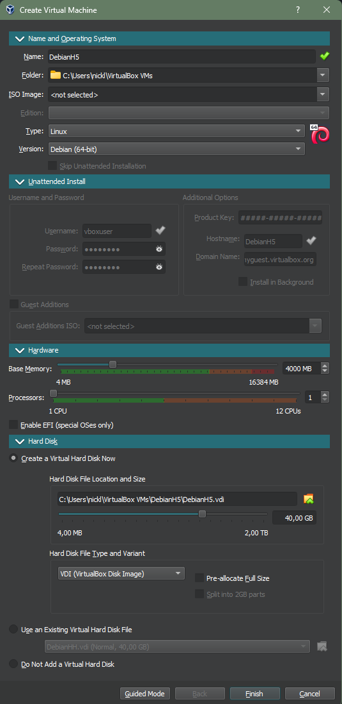
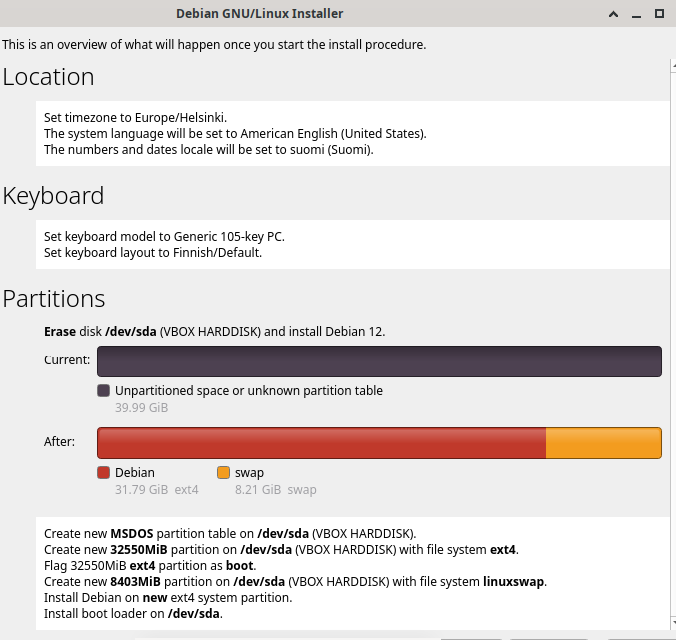
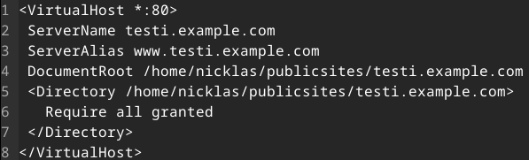
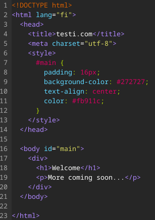
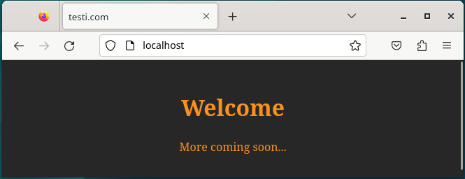
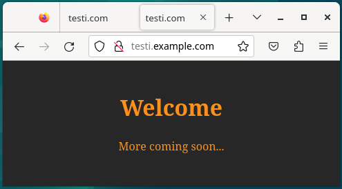
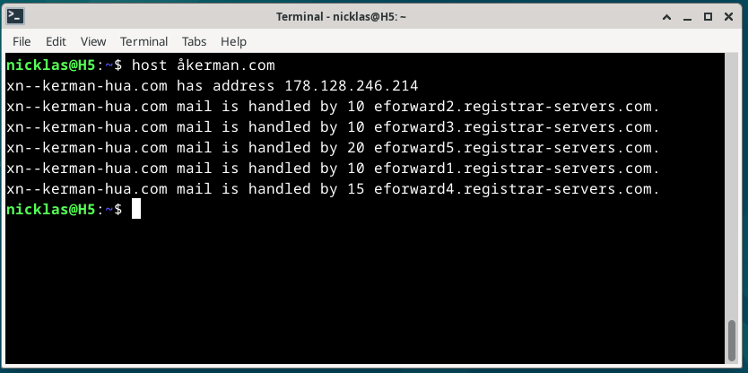
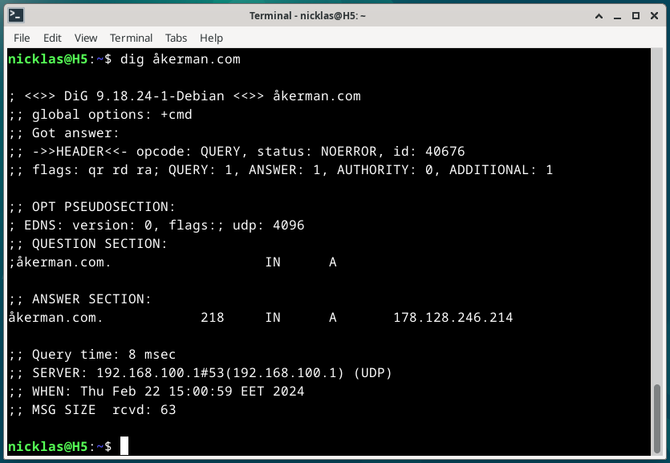
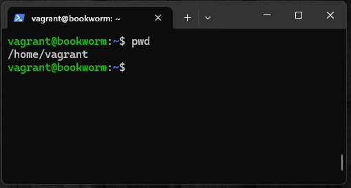

# Viikon 5 palautus

Olen tehtävissä merkannut aikoja ainoastaan olennaisiksi kokemiini osioihin. Viikon 5 tehtävät olivat seuraavat:

- a)[Koko juttu](https://github.com/NicklasHH/Linux-palvelimet/blob/master/h5%20Koko%20juttu/Palautus5.md#a-koko-juttu)
- b)[Pubkey](https://github.com/NicklasHH/Linux-palvelimet/blob/master/h5%20Koko%20juttu/Palautus5.md#b-pubkey)
- c)[Digging host](https://github.com/NicklasHH/Linux-palvelimet/blob/master/h5%20Koko%20juttu/Palautus5.md#c-digging-host)
- m)[Vapaaehtoinen](https://github.com/NicklasHH/Linux-palvelimet/blob/master/h5%20Koko%20juttu/Palautus5.md#m-vapaaehtoinen)

Lisäksi alla vielä suorat linkit fyysisen sekä virtuaalikoneen tietoihin:

- [ Fyysisen koneen tiedot](https://github.com/NicklasHH/Linux-palvelimet/blob/master/h5%20Koko%20juttu/Palautus5.md#fyysinen-tietokone)
- [ Virtuaalikoneen tiedot](https://github.com/NicklasHH/Linux-palvelimet/blob/master/h5%20Koko%20juttu/Palautus5.md#virtuaalikone)

Osion lähteet: (Karvinen 2024.)

---

## Fyysinen tietokone

- Windows 11 Home
  - Versio: 23H2
- Nvidia rtx 2060 näytönohjain
  - 6 GB muistia
- Intel i7-9750H prosessori
  - 6 ydintä
- 2 x 8GB Ram
- 1000 GB NVMe m.2 SSD
  - Josta vapaana +700Gb
- Viimeisimmät päivitykset ja ajurit asennettuna 14.2.2024

---

## Virtuaalikone

Virtuaalikonetta ajetaan `Oracle VM VirtualBox 7.0.14`
Virtuaalikoneen tiedot:

- Debian 12.4.0
- 40Gb muistia
- 4Gb Ram

---

## a) Koko juttu

Tehtävänä oli asentaa uusi tyhjä virtuaalikone ja tehdä sille jo opitut alkutoimet. Tehtävään sisältyi siis Apache-webpalvelimen asennus ja SSH-etähallintapalvelimen asennus sekä tehdä uusi etusivu webbipalvelimelle niin, että sivuja voi muokata normaalikäyttäjän oikeuksilla.(Karvinen 2024.)

#### Virtuaalikoneen tekeminen

1. Osio oli suhteellisen hyvin muistissa ja aloitin käynnistämällä Oraclen virtual boxin.

2. Painoin `New` painiketta ja avautuneessa ikkunassa oli suoraan `Expert mode` käytössä.

3. Täytin seuraavat tiedot ja painoin `Finish`:  
   

4. Valitsin DebianH5 aktiiviseksi ja painoin `Settings`

5. Valitsin avautuneessa ikkunassa storage välilehdeltä Controller: IDE alapuolella olevan `Empty` ja painoin Attributes osion pientä cd-levyn kuvaa ja valitsin `Choose/Create a Virtual Optical Disk...`

6. Avautuneesta valikosta painoin `Add` ja valitsin ensimmäisen viikon aikana ladatun Debianin levykuvan, jota se tarjosi automaattisesti. Osio viimeistellään painamalla `Choose` ja `OK`

#### Virtuaalikoneen Ensimmäinen käynnistys

1. Valitsin Virtual boxista `DebianH5` aktiiviseksi ja painoin `Start`

2. Painoin `Live system (amd64)` kohdalla `ENTER` jonka jälkeen tuli musta ruutu, joka meni ohi noin minuutin odottelun jälkeen.

3. Kokeilin asennuksen pikaisesti käynnistämällä selaimen. Tämän jälkeen painoin työpöydällä olevaa `Install Debian` painiketta, joka avasi tutun "Untrusted application launcher" varoituksen, josta ei tarvitse välittää -> `Launch Anyway`

4. Valitsin kieleksi `American English` ja painoin `Next`

5. Klikkasin kartasta suomea ja painoin `Next`

6. Valitsin listalta näppäimistön kieleksi `Finnish` ja testasin valikon alla olevaan laatikkoon ääkköset toimivuuden jonka jälkeen painoin `Next`

7. `Partitions` osiossa tarkistin että on valittuna `Erase disk` ja painoin `Next`

8. Syötin omat tietoni ja annoin **VAHVAN SALASANAN** jonka jälkeen `Next`

9. Yhteenveto täyttämistäni tiedoista jonka jälkeen painon `Install` kello 10.30 (Joka löytyi kun suurentaa ikkunan)  
   

10. Asenus oli valmistunut kahvinkeiton aikana kello 10.40, jonka jälkeen painoin oikeasta yläkulmasta `Restart` ja odottelin..

11. Kello 10.43 tuli sisäänkirjautumisikkuna johon kirjoitin aikaisemmin tekemäni käyttäjätunnuksen ja salasanan.

#### Ohjelmien asennus

1. **Aloitin asennukset resoluution vaihtamisesta:**

   - Painoin yläreunasta `Devices`
   - Valitsin `Insert Guest Additions CD image..`
   - Avasin Terminaalin ja kirjoitin komennot:
     > cd /media/nicklas/VBox_GAs_7.0.14/
     > ls
     > sudo bash VBoxLinuxAdditions.run
   - Kun terminaaliin tuli teksti alimmalle riville noin minuutin jälkeen tuli `were not restarted automatically` käynnistin virtuaalikoneen uudelleen **Application** -> **Log Out** -> **Restart**
   - Asennuksen toimivuuden testasin vetämällä ikkunaa erikokoiseksi, jolloin resoluutio vaihtui.

2. **Ohjelmien päivitys**

   - Terminaaliin komennot `sudo apt-get update` ja `sudo apt-get install`

3. **Micron asennus**
   - Terminaaliin komento `sudo apt-get install micro`
   - Kokeilin micron toimivuuden komennolla `micro testi` joka avasi micro editorin. Poistin tiedoston komennolla `rm testi`
   - Lisäsin micron oletuseditoriksi:
     > cd /etc
     > micro bash.bashrc
     > export EDITOR='micro' (Viimeiselle riville)
4. **Apachen asennus**

   - Terminaaliin komento `sudo apt-get install apache2`
   - Kokeilin selaimella näyttääkö localhost apachen vakiosivun

5. **SSH asennus**

   - Terminaaliin komento `sudo apt-get install openssh-server`

6. **Palomuurin asennus**
   - Terminaaliin komento `sudo apt-get install ufw`

#### Name based virtual host

1. Aloitin luomalla seuraavan kansiorakenteen terminaalilla

   > mkdir -p publicsites/testi.example.com
   > cd publicsites/testi.example.com/
   > micro index.html (sisällöksi testi)

2. Configurointi

   > sudoedit /etc/apache2/sites-available/testi.example.com.conf  
   > 

3. Sivuston käyttöönotto

   > cd /etc/apache2/sites-available
   > sudo a2ensite testi.example.com
   > sudo a2dissite 000-default.conf
   > sudo systemctl reload apache2

4. Selaimella localhost näyttää nyt testitekstin. Muutan sinne vielä HTML5 sisällön jonka myös validoin [HTML5 validaattorilla:](https://validator.w3.org/#validate_by_input)  
    

   

5. Muokkasin vielä osoitteen nimeä

   > sudoedit /etc/hosts

   > - Lisäsin seuraavan rivin:
   >   127.0.0.1 testi.example.com

   Testasin osoitteen testi.example.com
     

---

## b) Pubkey

Tehtävänä oli automatisoida kirjautuminen julkisella SSH-avaimella.(Karvinen 2024.)

1. Aloitin tehtävän luomalla SSH avaimen komennolla

   > ssh-keygen
   > Enter
   > En syötä salasanaa
   > Enter

2. Kopioin koko `id_rsa_pub` tiedoston sisällön Digital Oceaniin
   > komennolla `cat /home/nicklas/.ssh/id_rsa.pub` sain tiedoston sisällön
   > Digital oceanissa vasen reuna -> Settings
   > Security
   > Add SSH Key
   > Kohtaan Public key kopioin tiedoston sisällön
3. Testasin SSH avainta
Avain ei toiminut, koska olin luonut dropletin ilman SSH avainta. Helpoin reitti tähän oli se, että tein uuden dropletin, johon sain suoraan lisättyä tuon SSH avaimen. Uuden dropletin luotua sain otettua yhteyden komennolla `ssh root@152.42.134.241`. Poistin testin jälkeen tämän dropletin ja pitää tunnilla kysyä, kuinka saisin tuon nykyisen dropletin toimimaan SSH avaimen kanssa.

Osion lähteet: (Karvinen 2024, DigitalOcean 2024.)

---

## c) Digging host

Tehtävänä oli tutkia domain nimen tietoja `host` ja `dig` komennoilla. Tulokset tuli myös analysoida ja verrata tuloksia namecheapin weppiliittymässä näkyviin asetuksiin.(Karvinen 2024.)

1. Ohjeiden mukaan asensin host ja dig työkalut komennolla `sudo apt-get -y install bind9-dnsutils bind9-host`

2. host åkerman.com
Hostin manuaalin mukaan host komentoa voidaan käyttää selvittämään IP-osoite tai verkkotunnus.    
     

   - Komento näyttää IP osoitteen oikein
   - Sähköpostiosoite löytyy namecheapin mail settings osiosta ja käytössä on email forwarding ja osoitteena `v=spf1 include:spf.efwd.registrar-servers.com ~all`

2. dig åkerman.com
Manuaalin mukaan dig komentoa käytetään dns tietojen kyselyyn ja tarkistamiseen.  
     

   -  Dig kertoo sen, että åkerman.com vastaa ip osoitetta `178.128.246.214`
   - Kyselyn kestoksi ilmoitettiin 8 millisekuntia
   - Lisäksi on tiedot milloin ja mistä vastaus tuli

Osion lähteet: (Karvinen 2024)

---

## m) Vapaaehtoinen

Tehtävänä oli asentaa vagrant ja asentaa sillä uusi virtuaalikone.(Karvinen 2024.)

1. Aloitin asennuksen lataamalla Windowsille sopivan version(`AMD64`) hashicopr sivustolta(https://developer.hashicorp.com/vagrant/install?product_intent=vagrant)  

2. Käynnistin ladatun tiedoston `vagrant_2.4.1_windows_amd64` ja painelin kyllä ja next jokaiseen osioon, eli en tehnyt mitään muutoksia asennuksessa. Asennuksessa meni noin 5 minuuttia, jonka jälkeen käynnistin koneen uudestaan.

3. Avasin windowsin powershellin ja kirjoitin komennot
   > vagrant init debian/bookworm64
   > vagrant up <- tässä osiossa meni noin kaksi minuuttia
   > vagrant ssh
     

4. Avasin virtualboxin ja myös sinne oli ilmestynyt tämä virtuaalikone

5. poistin virtuaalikoneen powershellin komennolla `vagrant destroy`

   - Asennuksen poisto varmistui sillä, että se katosi myös virtualboxista.

Osion lähteet: (Karvinen 2024)

---

## Lähteet

Karvinen, T. 2024. Linux Palvelimet 2024 alkukevät. Luettavissa: https://terokarvinen.com/2024/linux-palvelimet-2024-alkukevat/. Luettu: 6.2.2024.

DigitalOcean 2024. How to Add SSH Keys to New or Existing Droplets. Luettavissa: https://docs.digitalocean.com/products/droplets/how-to/add-ssh-keys/. Luettu: 22.2.2024.
