# Viikon 6 palautus

Olen tehtävissä merkannut aikoja ainoastaan olennaisiksi kokemiini osioihin. Viikon 6 tehtävät olivat seuraavat:

- x)[ Kahden artikkelin huomiot](https://github.com/NicklasHH/Linux-palvelimet/blob/master/h6%20DJ%20Ango/Palautus6.md#x-kahden-artikkelin-huomiot)
- a)[ Yksinkertainen esimerkkiohjelma Djangolla](https://github.com/NicklasHH/Linux-palvelimet/blob/master/h6%20DJ%20Ango/Palautus6.md#a-yksinkertainen-esimerkkiohjelma-djangolla)
- b)[ Djangon tuotantotyyppinen asennus](https://github.com/NicklasHH/Linux-palvelimet/blob/master/h6%20DJ%20Ango/Palautus6.md#b-djangon-tuotantotyyppinen-asennus)

Lisäksi alla vielä suorat linkit fyysisen sekä virtuaalikoneen tietoihin:

- [ Fyysisen koneen tiedot](https://github.com/NicklasHH/Linux-palvelimet/blob/master/h6%20DJ%20Ango/Palautus6.md#fyysinen-tietokone)
- [ Virtuaalikoneen tiedot](https://github.com/NicklasHH/Linux-palvelimet/blob/master/h6%20DJ%20Ango/Palautus6.md#virtuaalikone)

Osion lähteet: (Karvinen 2024.)

---

## Fyysinen tietokone

- Windows 11 Home
  - Versio: 23H2
- Nvidia rtx 2060 näytönohjain
  - 6 GB muistia
- Intel i7-9750H prosessori
  - 6 ydintä
- 2 x 8GB Ram
- 1000 GB NVMe m.2 SSD
  - Josta vapaana +700Gb
- Viimeisimmät päivitykset ja ajurit asennettuna 27.2.2024

---

## Virtuaalikone

Virtuaalikonetta ajetaan `Oracle VM VirtualBox 7.0.14`
Virtuaalikoneen tiedot:

- Debian 12.4.0
- 40Gb muistia
- 4Gb Ram

---

## x) Kahden artikkelin huomiot

Tämän osion pääasiallinen tarkoitus on keskittyä artikkeleiden lukemiseen, joiden avulla viikon tehtävät tulisi pystyä suorittaa. Osiossa esitän muutamia omia havaintoja artikkeleihin liittyen.

#### Django 4 Instant Customer Database Tutorial -artikkeli

- Arikkelissa oli käytössä Debian 11 ja itsellä käytössä 12, joten on mielenkiintoista nähdä onko eroavaisuuksia.
- Artikkelissa huomautettiin, että pip käyttäessä tulee käyttää virtualenvyä ja sudoa ei pidä missään tilanteessa käyttää.
- Development serveriä ei tule käyttää internetissä!
- Artikkeli kuvaili hyvin järjestelmällisesti vaihe kerrallaan etenemisen, joten artikkelia on helppo seurata vaiheittain.

Osion lähteet: (Karvinen 2022a)

#### Deploy Django 4 - Production Install -artikkeli

- Artikkelissa asennetaan Django 4, mutta tunnilla oli puhetta, että tarjolla olisi myös Django 5, mitä aion itse käyttää.
- Artikkeli kuvasti vielä tarkemmin vaiheet verrattuna aikaisempaan artikkeliin.
- "Connect Python to Apache using mod_wsgi" osiossa on yleispätevä conf tiedosto, missä on muuttujien avulla määritelty polut
- Apache ei automaattisesti tunnista muokattuja tiedostoja, joten kun tiedostoa on muokannut, voi muutokset ottaa käyttöön komennolla `touch kansio/tiedosto.py` tai `sudo systemctl restart apache2`
- Virhetilanteita varten on hyvä muistaa virhelogi `sudo tail /var/log/apache/error.log`
- Debugin käyttö hyödyllinen paikallisessa ajossa virheiden etsintään, mutta julkaistaessa se tulee ottaa pois päältä
- Apachelle pitää asentaa WSGI moduuli komennolla `sudo apt-get -y install libapache2-mod-wsgi-py3`

Osion lähteet: (Karvinen 2024b)

---

## a) Yksinkertainen esimerkkiohjelma Djangolla

Tunnilla aloiteltiin tätä projektia, joten otin virtuaalikoneen jolla en tätä tehnyt.

1. Ensimmäisenä asensin virtualenv ja python3-pip

   > sudo apt-get update  
   > sudo apt-get install virtualenv python3-pip

2. Loin tälle projektille oman kansion
   > mkdir django  
   > cd django  
   > polku on `/home/nicklashh/django`
3. Asennukset virtualenvissä
   > virtualenv -p python3 --system-site-packages env  
   > source env/bin/activate  
4. Requirements.txt
   > micro requirements.txt(Sisällöksi `django`)  
   > ajetaan asennus `pip install -r requirements.txt`  
5. Uusi projekti

   > `django-admin startproject testiprojekti`

   > siirrytään kansioon `cd testiprojekti` komennolla  

   > käynnistys komennolla `./manage.py runserver`   
   > 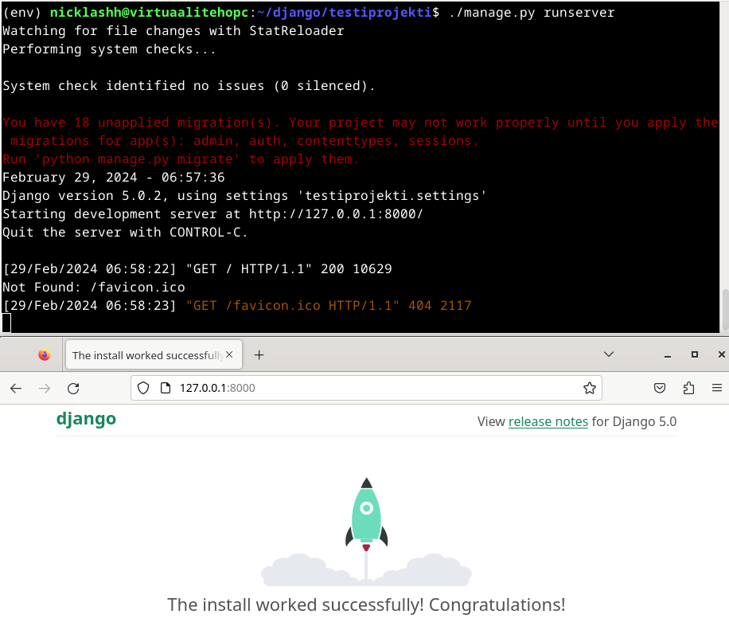  
   > Suljetaan palvelin CTRL + C

6. Admin osion muutokset

   > Osoitteessa `127.0.0.1:8000/admin/` on sisäänkirjautumista varten ikkuna, joten laitetaan se toimimaan seuraavasti:  
   > `./manage.py makemigrations`  
   > `./manage.py migrate`   
   > `sudo apt-get install pwgen`    
   > `pwgen -s 20 1 # randomize a password`    
   > `./manage.py createsuperuser` (täytin vain salasanan)    

   > Komennolla `./manage.py runserver` projektin käynnistys ja sisäänkirjautumisyritys admin sivulle  
   > 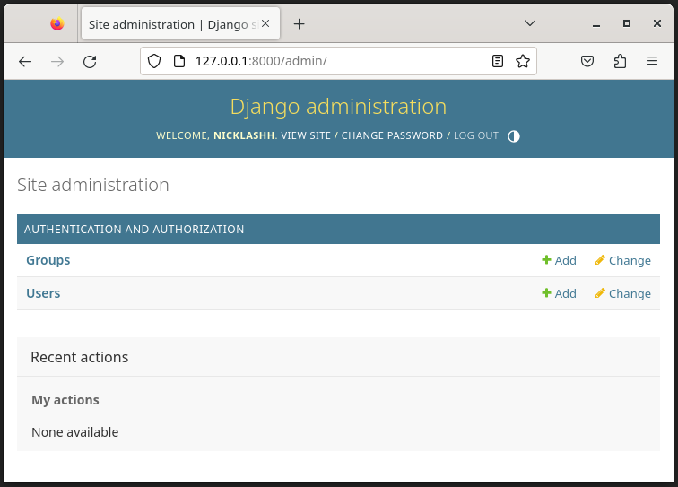  

   > Lisäsin vielä users osiossa uuden käyttäjän ja testasin, että pystyn kirjautumaan sille ja lisäsin sille kaikki oikeudet.  

7. Lisätään tietokanta

   > Komento `./manage.py startapp crm` luo uuden uuden kansion  
   > Komennolla `micro testiprojekti/settings.py` avasin settings.py tiedoston ja lisäsin `INSTALLED_APPS` osioon `'crm'`  
   > Avasin models.py tiedoston `micro crm/models.py` ja lisäsin sinne uuden luokan:    
   > 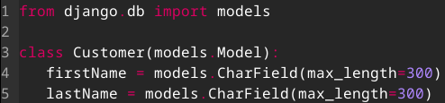  
   > `./manage.py makemigrations` <-- Tietokantaan tehdessä muutoksia  
   > `./manage.py migrate` <-- Tietokantaan tehdessä muutoksia  
   > `micro crm/admin.py` <-- Tietokanta tulee rekisteröidä  
   > 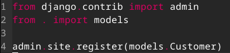  
   > - Testataan toiminta komennon `./manage.py runserver` jälkeen  
   > - Nyt voidaan luoda asiakkaita:  
   >   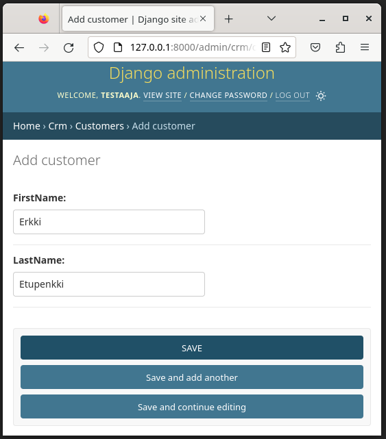  

8. Muokataan vielä nimien näyttäminen
   `micro crm/models.py`  

   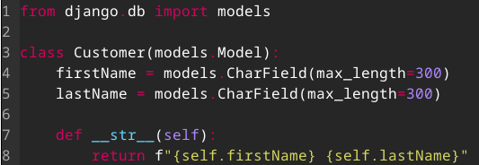  

   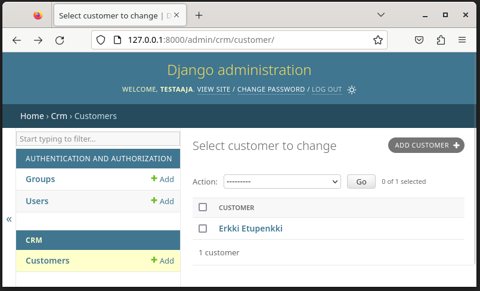  

Osion lähteet: (Karvinen 2022a)

---

## b) Djangon tuotantotyyppinen asennus

1. Aloitin asentamalla uuden debianin, johon asensin:

- VBoxLinuxAdditions
- Apache
- micro(sekä micro vakioeditoriksi)

2. Tein kansiot, index.html ja virtualhostin

   > `mkdir -p publicwsgi/tuotanto/static/`  
   > `echo "Staattinen"|tee publicwsgi/tuotanto/static/index.html`  
   > `sudoedit /etc/apache2/sites-available/tuotanto.conf`  
   > 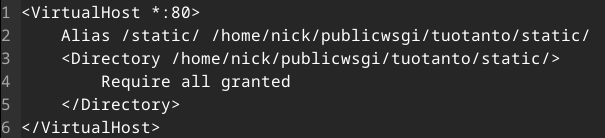   
   > `sudo a2ensite tuotanto.conf`    
   > `sudo a2dissite 000-default.conf `     
   > `sudo systemctl restart apache2`   
   > `curl http://localhost/static/`  

3. Djangon asennus ja aktivointi VirtualEnviin

   > `sudo apt-get -y install virtualenv`   
   >`cd`   
   >`cd publicwsgi/`   
   > `virtualenv -p python3 --system-site-packages env`   
   > `source env/bin/activate`   
   > `which pip` (palautuksena: /home/nick/publicwsgi/env/bin/pip)  
   > `micro requirements.txt` (Kirjoitin: `django`)  
   > `pip install -r requirements.txt`   
   > `django-admin --version` palautti version: `5.0.2`  

4. Django projektin asennus

   > `django-admin startproject tuotanto`
   > Tuli virhe `CommandError: '/home/nick/publicwsgi/tuotanto' already exists` joten poistin aiemmin luodun tuotanto kansion menemällä polkuun `/home/nick/publicwsgi` ja antamalla komennon `rm -r tuotanto` ja sen jälkeen uudestaan `django-admin startproject tuotanto`
   > Loin uudestaan kansion static `mkdir static` ja luodussa kansiossa `micro index.html` ja tarkistin sen toiminnan

5. Tuotanto.conf tiedoston asettaminen

   > `sudoedit /etc/apache2/sites-available/tuotanto.conf`
   > 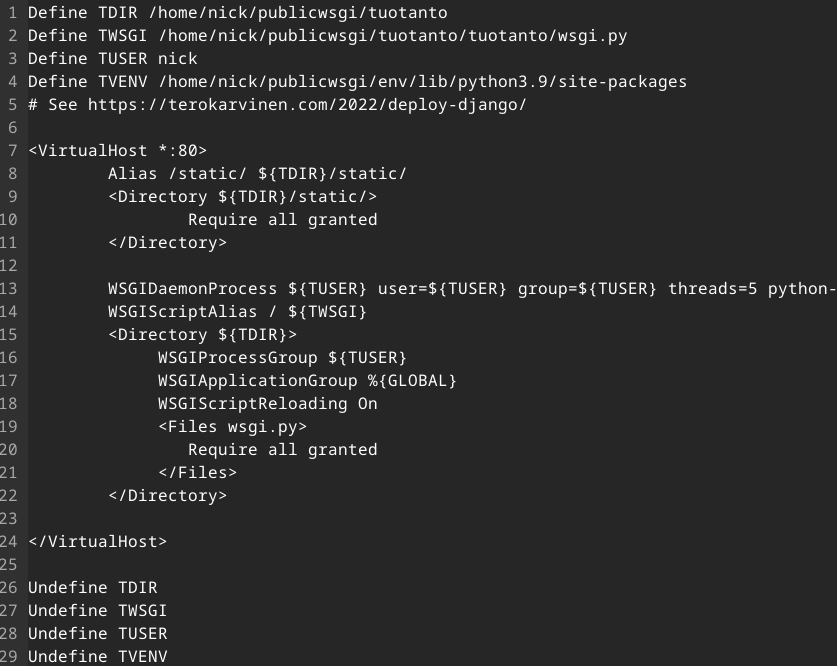 >`sudo apt-get -y install libapache2-mod-wsgi-py3` > `sudo systemctl restart apache2`
   > localhost antoi virheen, joten errorlogeja tutkimaan `sudo tail /var/log/apache2/error.log` josta löytyi virheitä:
   > 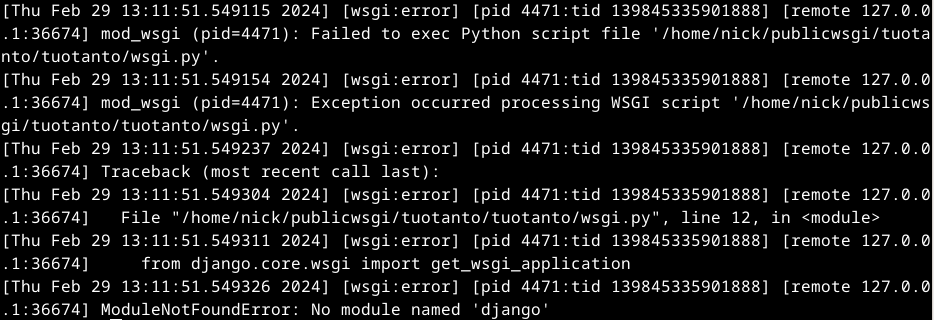
   > Ensimmäisenä tarkistin polut ja kaikki polut olivat toimia. Seuraavaksi menin tarkistamaan tuotanto.conf tiedoston polkuja ja huomasin, että polku `/home/nick/publicwsgi/env/lib/python3.9/site-packages` ei toiminut joten lähdin seuraamaan polkua ja oikea polku olikin `/home/nick/publicwsgi/env/lib/python3.11/site-packages`. Tallensin conf tiedoston ja käynnistin apachen uudelleen `sudo systemctl restart apache2` jonka jälkeen kaikki alkoi toimimaan.
   > 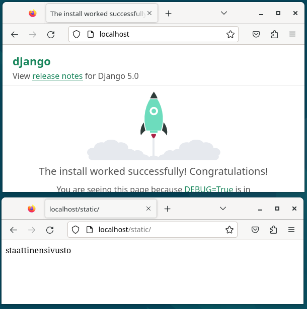

6. Debugin poispäältä ottaminen

   > `cd` > `cd publicwsgi/tuotanto/` > `micro tuotanto/settings.py` > `DEBUG = False` > `ALLOWED_HOSTS = ['localhost']` > `touch tuotanto/wsgi.py` <-- Tällä saadaan muutokset käyttöön

7. CSS asentaminen
   Lähtötilanne localhost/admin:
   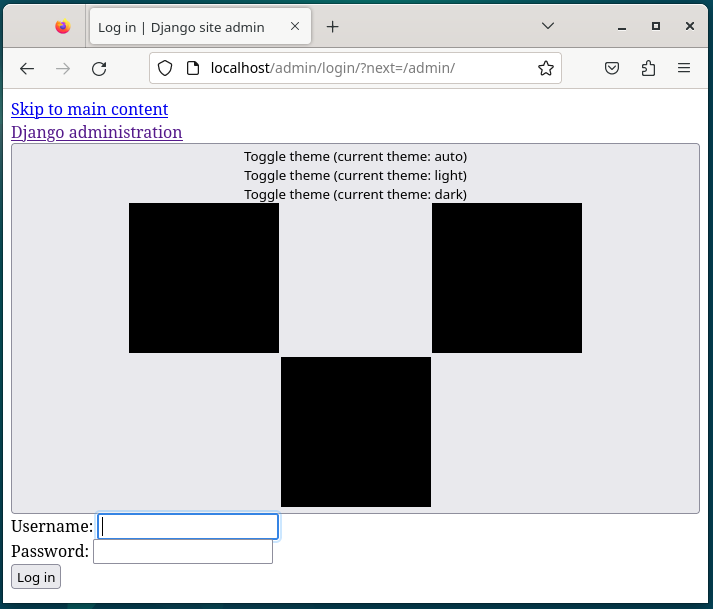

   > `cd` > `cd publicwsgi/tuotanto/` > `micro tuotanto/settings.py`

   Lisätään koodi alkuun:

   > `import os`

   Lisätään static files osioon

   > `STATIC_ROOT = os.path.join(BASE_DIR, 'static/')`

   > Ajetaan komento `./manage.py collectstatic` >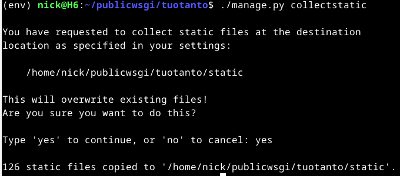

   > Ulkoasu on muuttunut
   > 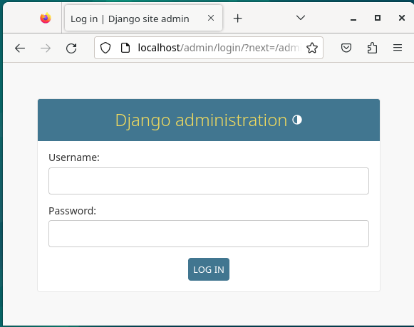

Osion lähteet: (Karvinen 2022b)

---

## Lähteet

Karvinen, T. 2022a. Django 4 Instant Customer Database Tutorial. Luettavissa: https://terokarvinen.com/2022/django-instant-crm-tutorial/. Luettu: 27.2.2024.

Karvinen, T. 2022b. Deploy Django 4 - Production Install. Luettavissa: https://terokarvinen.com/2022/deploy-django/. Luettu: 27.2.2024.

Karvinen, T. 2024. Linux Palvelimet 2024 alkukevät. Luettavissa: https://terokarvinen.com/2024/linux-palvelimet-2024-alkukevat/. Luettu: 27.2.2024.
