# Viikon palautus 7

Olen tehtävissä merkannut aikoja ainoastaan olennaisiksi kokemiini osioihin. Viikon 6 tehtävät olivat seuraavat:

- a)[ "Hei maailma" kääntäminen]()
- b)[ Uusi komento kaikille käyttäjille]()
- c)[ Vanhan laboratorioharjoituksen ratkaiseminen]()
- d)[ Tyhjän virtuaalikoneen asennus]()

Lisäksi alla vielä suorat linkit fyysisen sekä virtuaalikoneen tietoihin:

- [ Fyysisen koneen tiedot]()
- [ Virtuaalikoneen tiedot]()

Osion lähteet: (Karvinen 2024.)

---

## Fyysinen tietokone

- Windows 11 Home
  - Versio: 23H2
- Nvidia rtx 2060 näytönohjain
  - 6 GB muistia
- Intel i7-9750H prosessori
  - 6 ydintä
- 2 x 8GB Ram
- 1000 GB NVMe m.2 SSD
  - Josta vapaana +700Gb
- Viimeisimmät päivitykset ja ajurit asennettuna 7.3.2024

---

## Virtuaalikone

Virtuaalikonetta ajetaan `Oracle VM VirtualBox 7.0.14`
Virtuaalikoneen tiedot:

- Debian 12.4.0
- 40Gb muistia
- 4Gb Ram

---

## a) "Hei maailma" kääntäminen
ABC

1. Python:  
  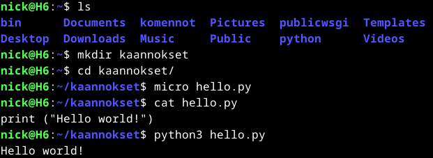  

2. Bash:  
  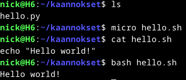  

3. Lua:   
  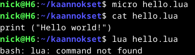  
  Tässä homma ei toiminutkaan suoraan ja oletin, että minun tuli asentaa lua. Kirjoitin komennon `sudo apt-get install lua` ja painoin tabia kunnes aukesi kysely, haluanko näyttää kaikki 178 tulosta. Vastattuani kyllä, etsin listalta viimeisimmän version joka oli tässä tapauksessa lua5.4. Asensin sen komennolla `sudo apt-get install lua5.4` jonka jälkeen toimii:  
  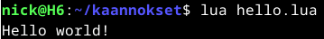   

4. Java:
  Javasta oli tunnilla jo puhetta, että sille tulee asentaa jdk, joten etsin sen komennolla `sudo apt-get install openjdk` ja tabia painelemalla löytyikin hakemani ja sen asentaminen vei alle minuutin:  
  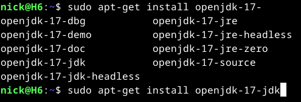    
  Asennuksen jälkeen kirjoitin koodin:  
  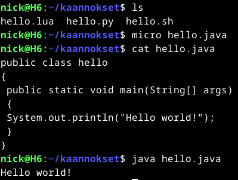  

Osion lähteet: (Karvinen 2018)

---

## b) Uusi komento kaikille käyttäjille
Tein osiossa ohjelman, joka kertoo käyttäjätunnuksen, tiedostopolun sekä alikansiot. Tunnilla käytiin asiat läpi, mutta pientä muistinvirkistystä hain tunnilla tekemistäni muistiinpanoista sekä Teron artikkelista "Shell Scripting"

1. Aloitin luomalla kansion ja sen sisään tiedoston minne kirjoitin  mitä komentototulkkia tulee käyttää skriptin suoritukseen ja sen jälkeen annoin komennot jotka skripti suorittaa:  
  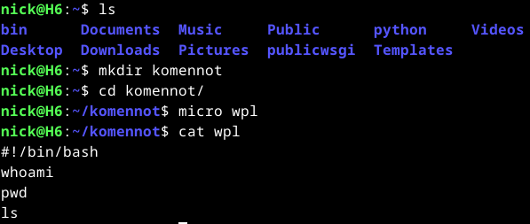  

2. Seuraavaksi lisäsin luku ja kirjoitusoikeudet ja testasin komennon:  
  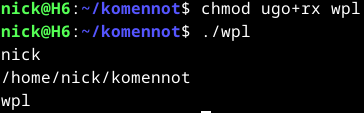  

3. Kopioin vielä wpl tiedoston polkuum /usr/local/bin/ komennolla: `sudo cp wpl /usr/local/bin/` jonka jälkeen testasin komentoa:  
  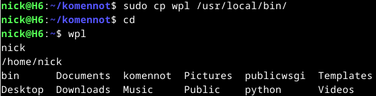  

Osion lähteet: (Karvinen 2007, Omat muistiinpanot tunnilta 7(5.3.2024))

---

## c) Vanhan laboratorioharjoituksen ratkaiseminen
Otin tehtäväksi vuoden 2023 kurssin labraharjoituksen: [**Final Lab for Linux Palvelimet 2023.**](https://terokarvinen.com/2023/linux-palvelimet-2023-arvioitava-laboratorioharjoitus/) Tein harjoituksesesta seuraavat tehtävät(Linkki raportin oikeaan osaan):
- d) ['hey']()
- f) [Stattisesti sinun]()
- g) [Salattua hallintaa]()
- h) [Djangon lahjat]()

Suoritin tehtävän uudella virtuaalikoneella:
  > 4GB RAM  
  > 2 CPU  
  > 40GB tallennustilaa 
  > Debian 12.4.0
  > Ohjelmat päivitetty
  > Ajurit asennettu, jotta resoluutiota voi muokata (Testattu toiminta vetämällä ikkunaa eri kokoiseksi)
  > Micro asennettu (Testattu toiminta komennolla: `micro testitexti`)
  > Palomuuri asennettu ja porttiin 80 tehty reikä
  

#### d) 'hey'
Tehtävänä oli:  
  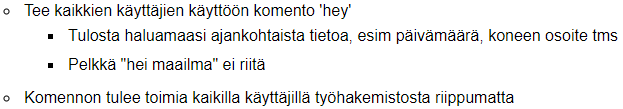  
1. Tein ensin kansion, tiedoston ja itse koodin:
  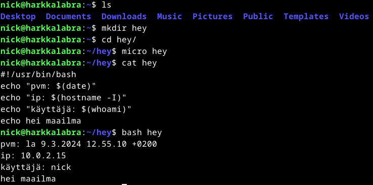  
2. Vaihdoin käyttöoikeudet seuraavasti `chmod ugo+rx hey` ja kopioin kansion polkuun jotta koodi toimii kaikilla käyttäjillä komennolla `sudo cp hey /usr/local/bin/`
3. Tein toisen käyttäjän komennolla `sudo adduser toinen` ja täyttelin tietoja.
4. Testasin toiminnan vaihtamalla luodulle käyttäjälle komennolla `su - toinen` ja kirjoitin `hey`:
    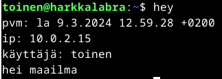  

Tehtäväkokonaisuus meni ulkomuistista aika kivasti.
Osion lähteet: (Karvinen 2023)

#### f) Stattisesti sinun
Tehtävänä oli:  
  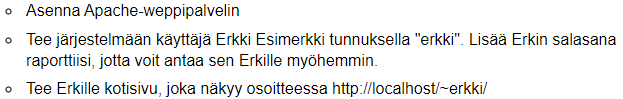  

1. **Aloitin asentamalla apachen:**
  - `sudo apt-get update` (En muistanut olinko jo tehnyt tämän, joten tein varuiksi)
  - `sudo apt-get install apache2`
  - Testattu toiminta komennolla: `curl localhost`
2. **Uuden tunnuksen luonti:**
  - Aloitin asentamalla salasanageneraattorin `sudo apt-get install pwgen` ja tein salasanan komennolla `pwgen -s 20 1`(NicklasHH 2024) 
  - Komennolla `sudo adduser erkki` loin uuden tunnuksen ja annoin salasanaksi äskön generaattorilla luodun salasanan: `ke3m6xkOdCOz2i7lB6Hf`
3. **Erkille etusivu**
  Koska erkin etusivu tulee public_html alle, tulee userdir ottaa käyttöön komennolla `sudo a2enmod userdir`
    > su - erkki
    > mkdir public_html
    > cd public_html
    > micro index.html

4. **Lopuksi vielä oikeudet kuntoon:**
  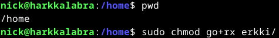  

5. **Apachen uudelleenkäynnistys**
  >sudo systemctl restart apache2

6. **Erkin etusivun testaus:**
   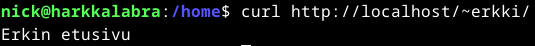 

Osion lähteet: (Karvinen 2023)

#### g) Salattua hallintaa
Tehtävänä oli:  
  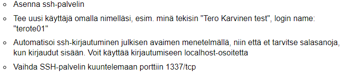  
1. **SSH asennus:**
   - `sudo apt-get install openssh-server`

2. **sudo adduser nickte01**
    - Hankitaan vahva salasana komennolla `pwgen -s 20 1`
    - `sudo adduser nickte01` <- lisätään tähän aikaisemmin luotu salasana(QUh017vDSIyPUes65rMF)

3. SSH automatisointi
  - `ssh-keygen` komennolla ssh avaimen luonti
  - `ssh-copy-id nickte01@localhost`
  - Ensimmäisellä kerralla tuli salasana syöttää, joten poistun antamalla komennon `logout`
  - Testasin SSH toiminnan komennolla `ssh nickte01@localhost`  
  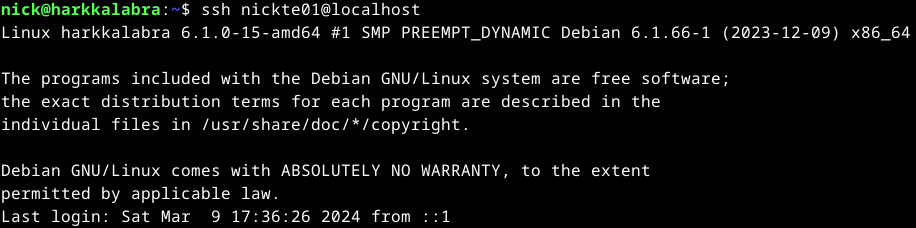  

4. SSH palvelimen portin konfigurointi.
  - micro /etc/ssh/sshd_config (Rivillä 15 vaihdoin #port 22 kohdan numeron 1337)(Tieto löytyi *Ionoksen* sivuilta)
  - `sudo systemctl restart ssh`
  - Ensimmäisenä jouduin etsimään, kuinka löydän aktiiviset portit. Hetken googleteltua löysin *Giten* kirjoittaman artikkelin mistä löysin komennon: `sudo lsof -i -P -n | grep LISTEN`. Tällä komennolla katsoin, mitkä portit ovat aktiivisia, mutta siellä näkyi sshd kohalla edelleen *:22, joten muokkasin vielä sshd_config tiedostoa seuraavasti: `#port 1337` -> `port 1337`
  - `sudo systemctl restart ssh`
  - `sudo lsof -i -P -n | grep LISTEN` Nyt tässä näkyi käytössä portti 1337:  
   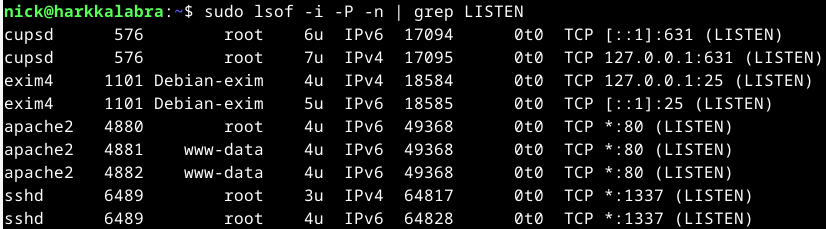

Olisin myös voinut hakea suoraan portilla 1337 seuraavalla komennolla `sudo lsof -i:1337`  
  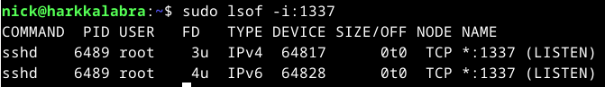  

Osion lähteet: (Ionos, Gite 2024)

#### h) Djangon lahjat
Tehtävänä oli:  
  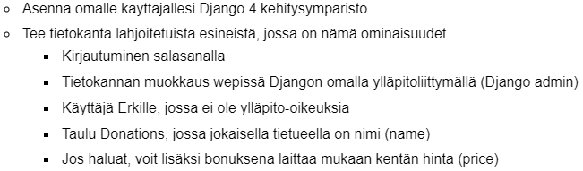
1. Asensin virtualenvin `sudo apt-get install virtualenv python3-pip`
2. Loin projektille oman kansion
    - mkdir django
    - cd django
    - polku on `/home/nick/django`
3. Virtualenv asennukset
    - `virtualenv -p python3 --system-site-packages env`
    - `source env/bin/activate`
    - `micro requirements.txt`(Sisällöksi django)
    - Suoritetaan asennus `pip install -r requirements.txt`

4. Uusi django projekti
    - `django-admin startproject Lahjoitukset`
    - `cd Lahjoitukset`
    - Käynnistetään komennolla `./manage.py runserver`
    - Tarkistin lentääkö raketti osoitteesa `http://127.0.0.1:8000/`

5. Laitoin admin sivun toimimaan oikein seuraavasti:
    - `./manage.py makemigrations` 
    - `./manage.py migrate`
    - `pwgen -s 20 1` - Luodaan salasana(FNPHX0TUY8oqsro1Bahn)
    - `./manage.py createsuperuser` - Luodaan adminille tunnus(täytin vain salasanan)
    - `./manage.py runserver`
    - Osoitteessa `127.0.0.1:8000/admin/` kirjauduin sisään tunnuksella ja salasanalla

6. Erkille käyttäjä
    - Ollessani kirjautuneena sisään admin sivulle, klikkasin Users osiossa `Add`
    - Username kohtaan = `Erkki`
    - Salasana = HOewavQ0SxWtAsmQDwQn
    - Save
    - Lisäsin erkille vielä Etu- ja Sukunimen sekä laitoin aktiiviseksi `Staff statuksen`
    - Save
    - Kokeilin vielä kirjautua sisään erkin tunnuksella ja salasanalla, jotta voin todeta kaiken olevan OK.

  7. Tietokanta
    - `./manage.py startapp tietokanta`
    - `micro Lahjoitukset/settings.py`
    - Lisäsin `INSTALLED_APPS` osion viimeiselle riville `'tietokanta',`
    - Avasin `micro tietokanta/models.py` laittaakseni luokat kuntoon  
    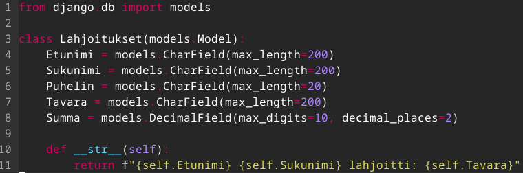  
    - Avasin `micro tietokanta/admin.py` jonne lisäsin tietokannan  
      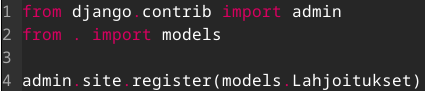  
    - `./manage.py makemigrations` - Tulee päivittää tietokantamuutoksien yhteydessä
    - `./manage.py migrate` - Tulee päivittää tietokantamuutoksien yhteydessä  
      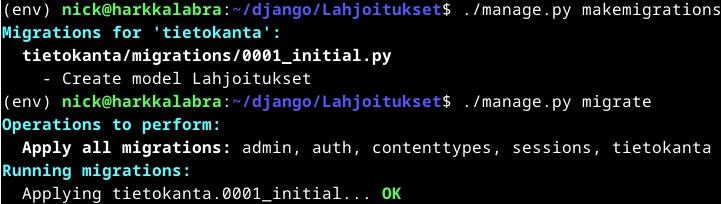  
    - `micro tietokanta/admin.py` - Rekisteröin tietokannan
    - `./manage.py runserver` - serveri takaisin päälle  
    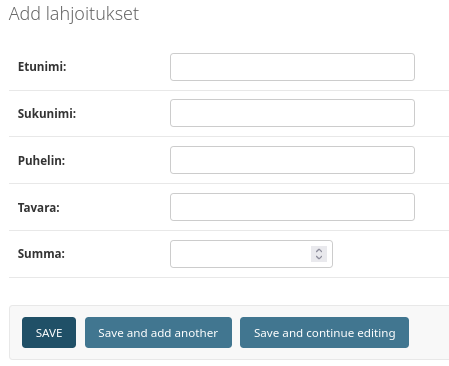  
    - Lisäsin erkille vielä oikeudet katsoa tietokantaa lahjoitukset   
    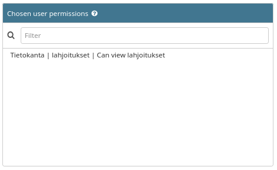  

  **VALMIS**  
    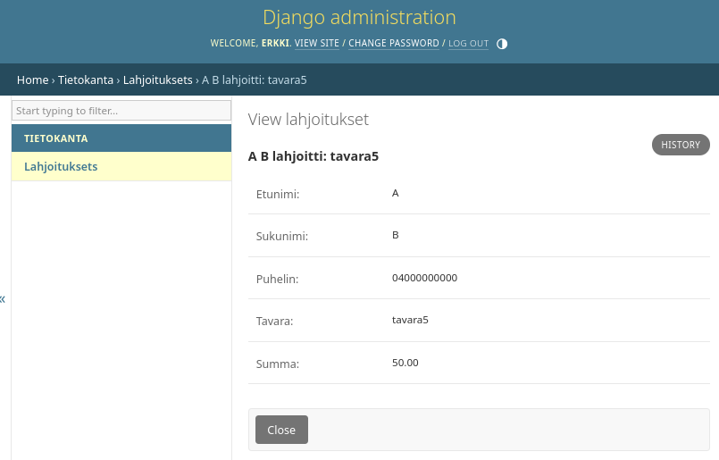

Osion lähteet: (NicklasHH 2024) 

---

## d) Tyhjän virtuaalikoneen asennus
Arvioitavaa labraa varten tulee olla asennettuna tyhjä virtuaalikone. Koneelle saa ainoastaan päivittää ohjelmistot sekä asentaa palomuurin.
1. Tein asennuksen Virtualboxiin:  
  > 4GB RAM  
  > 2 CPU  
  > 40GB tallennustilaa  
  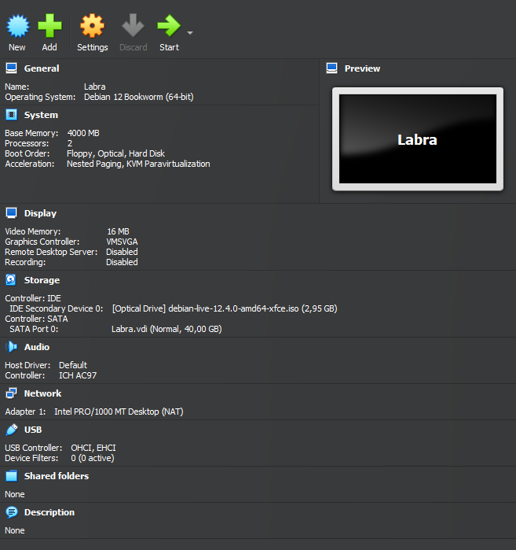  

2. Käynnistin virtuaalikoneen ja painoin työpöydän kuvaketta `Install Debian`  
  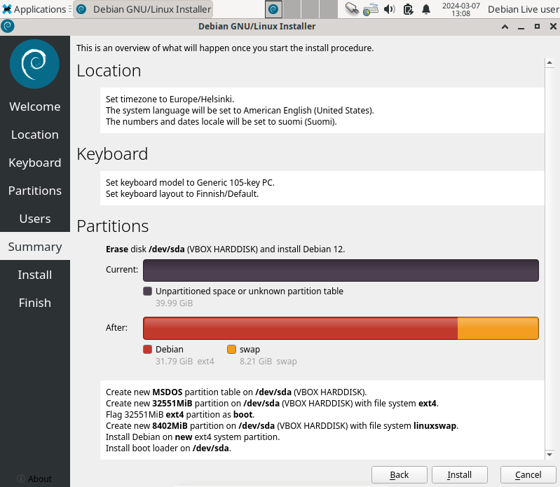
  > Nimi: Nicklas Akerman
  > Tunnus: nick
  > Tietokone: labra
  > **Vahva salasana**

3. Kun asennus oli muutaman minuutin päästä ohi, käynnistin tietokoneen uudelleen ja kirjoitin komennot:
  > sudo apt-get update
  > sudo apt-get install
  > sudo apt-get install ufw  
  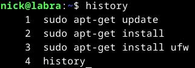  

---

## Lähteet
Gite, v. 2024. How to check if port is in use on Linux or Unix. Luettavissa: https://www.cyberciti.biz/faq/unix-linux-check-if-port-is-in-use-command/. Luettu 9.3.2024.

Ionos. Changing the Default SSH Port. Luettavissa: https://www.ionos.com/help/server-cloud-infrastructure/getting-started/important-security-information-for-your-server/changing-the-default-ssh-port/. Luettu: 9.3.2024.

Karvinen, T. 2007. Shell Scripting. Luettavissa: https://terokarvinen.com/2007/12/04/shell-scripting-4/?fromSearch=scripting. Luettu: 7.3.2024.

Karvinen, T. 2008. Install Apache Web Server on Ubuntu. Luettavissa: https://terokarvinen.com/2012/03/16/2008/install-apache-web-server-on-ubuntu-4. Luettu: 9.3.2024.

Karvinen, T. 2018. Hello World Python3, Bash, C, C++, Go, Lua, Ruby, Java – Programming Languages on Ubuntu 18.04. Luettavissa: https://terokarvinen.com/2018/hello-python3-bash-c-c-go-lua-ruby-java-programming-languages-on-ubuntu-18-04/?fromSearch=hello%20world. Luettu: 7.3.2024.

Karvinen, T. 2023. Final Lab for Linux Palvelimet 2023. Luettavissa: https://terokarvinen.com/2023/linux-palvelimet-2023-arvioitava-laboratorioharjoitus/. Luettu: 9.3.2024.

Karvinen, T. 2024. Linux Palvelimet 2024 alkukevät. Luettavissa: https://terokarvinen.com/2024/linux-palvelimet-2024-alkukevat/. Luettu: 7.3.2024.

NicklasHH 2024. Viikon 6 palautus. Luettavissa: https://github.com/NicklasHH/Linux-palvelimet/blob/master/h6%20DJ%20Ango/Palautus6.md. Luettu: 9.3.2024.