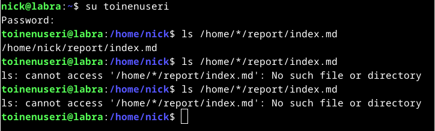
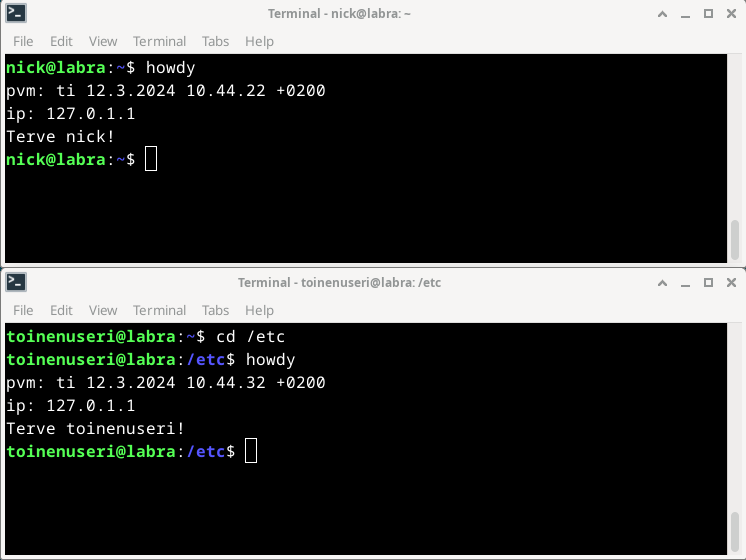
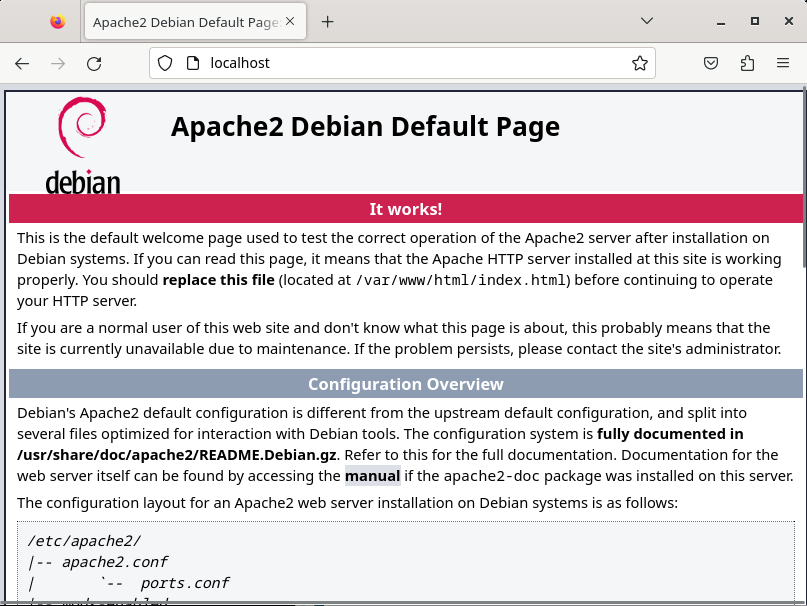
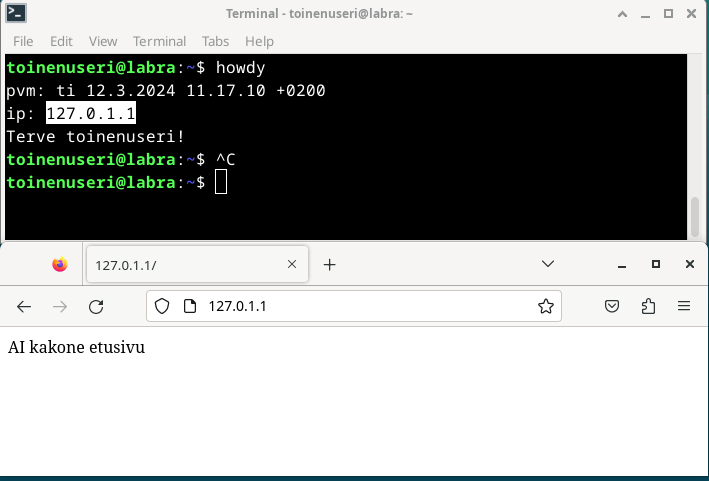
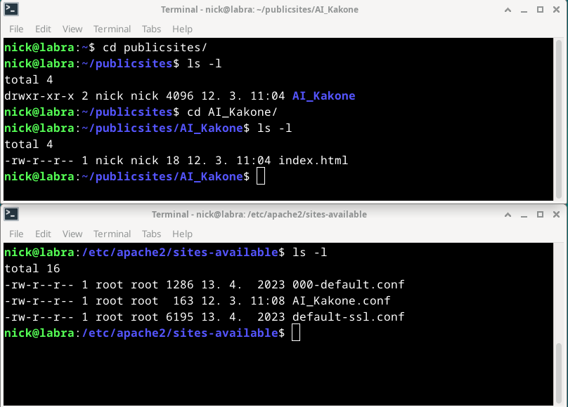
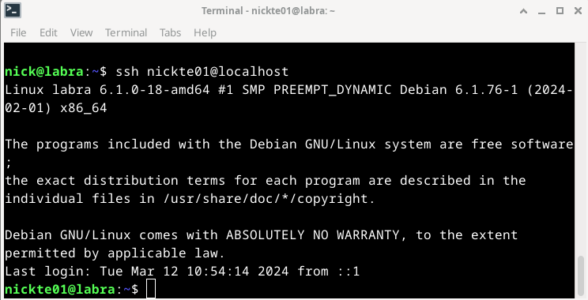
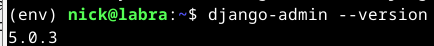
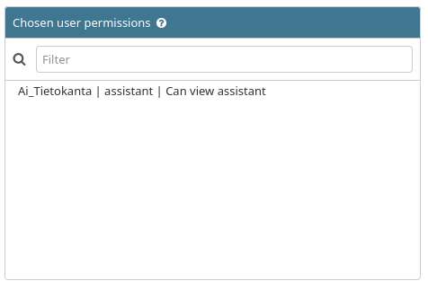
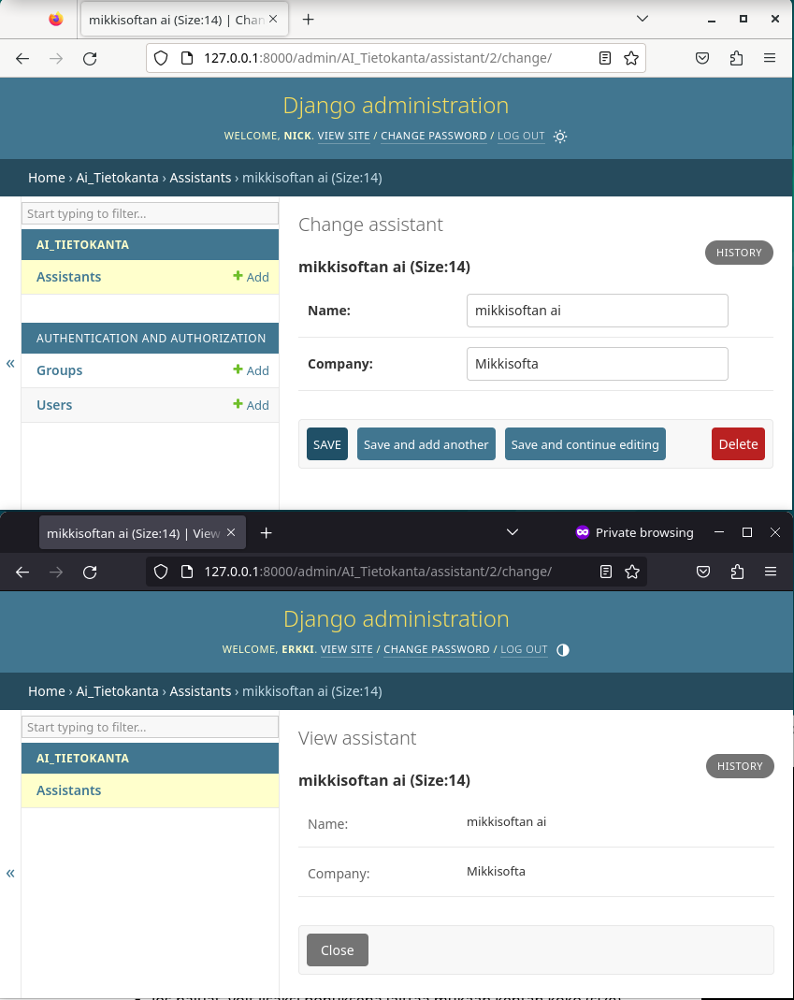
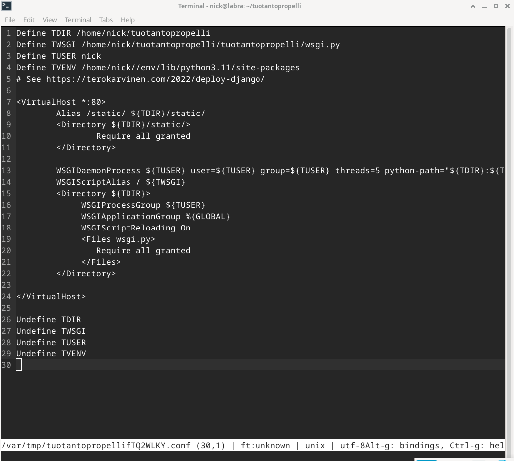

# Final Lab for Linux Palvelimet 2024 Spring
	Osion lähteet(Karvinen 2024)

## a) Taustatiedot
    - Nimi: Nicklas Åkerman  
    - Opiskelijanumero: 2200539  
    - Kotitehtävät: https://github.com/NicklasHH/Linux-palvelimet  
    - Olen raportin loppuun kirjoittanut kaikki tunnukset/salasanat  

## b) Tiivistelmä koko työstä lopuksi
	1. Toimii  
		- c) Ei kolmea sekoseiskaa = kokonaisuudessaan(Testattu)  
		- d) 'howdy' = kokonaisuudessaan(Testattu)  
		- e) Etusivu uusiks = Kokonaisuudessaan(Testattu)  
		- g) Salattua hallintaa = Kokonaisuudessaan(Testattu)  
		- h) Djangon lahjat = Kokonaisuudessaan(Testattu)  
	2. Ei toimi  
		- h) Tuotantopropelli, Aika loppui kesken

## c) Ei kolmea sekoseiskaa  
Tein toisen käyttäjän tarkistaakseni lopputuloksen, ensin komento ilman oikeuksien muokkausta perässä oikeuksien muokkauksen jälkeen:  
  

## d) 'howdy'  
Testasin komennon omalla käyttäjälläni sekä edellisessä osiossa luodulla "toinenuseri" käyttäjällä joka oli /etc hakemistossa  
  

Osion lähteet(NicklasHH 2024)

## e) Etusivu uusiks  
1. Apachen asennuksen toimivuus testattu:  
  

2. Toimiva etusivu IP osoitteella:  
  

3. Tarvittavien tiedostojen ja kansioiden oikeudet   
  

4. Polussa `/home/nick/publicsites/AI_Kakone` komennolla `micro index.html` pääsee etusivua muokkaamaan ilman sudo oikeuksia.  

## g) Salattua hallintaa
1. Asensin ssh  
2. Tein käyttäjän nickte01  
3. SSH yhteys:  
  
	
Osion lähteet(NicklasHH 2024)

## h) Djangon lahjat
1. Djangon asennus  
	  
	
2. Lisäsin Erkille Staff statuksen view oikeuksia djangon web liittymän kautta.    
  

3. Tietokantaan lisätty kentät tekoälyn nimelle ja omistajan yritykselle. Lisäksi tietokantaan on lisätty (models.py) toiminto, jolla näytetään Name kentän pituus.(Helsingin yliopisto s.a.)  
  

Osion lähteet(NicklasHH 2024, Helsingin yliopisto s.a., Karvinen 2022a)
	
## h) Tuotantopropelli
1. Tehty tuotantopropelli projekti `django-admin startproject tuotantopropelli`  
2. Tehty tuotantopropelli.conf `sudoedit /etc/apache2/sites-available/tuotantopropelli.conf`  

3. Asennettu WSGI moduuli `sudo apt-get -y install libapache2-mod-wsgi-py3`
4. Aika loppui  
Osion lähteet(Karvinen 2022b)
## Lähteet:

Helsingin yliopisto s.a. Object oriented programming techniques. Luettavissa: https://programming-23.mooc.fi/part-10/3-oo-programming-techniques Luettu: 12.3.2024.  

Karvinen, T. 2022a. Django 4 Instant Customer Database Tutorial. Luettavissa: https://terokarvinen.com/2022/django-instant-crm-tutorial/ Luettu: 12.3.2024.  

Karvinen, T. 2022b. Deploy Django 4 - Production Install. Luettavissa: https://terokarvinen.com/2022/deploy-django/?fromSearch=production Luettu: 12.3.2024.

Karvinen, T. 2024. Final Lab for Linux Palvelimet 2024 Spring. Luettavissa: https://terokarvinen.com/2024/arvioitava-laboratorioharjoitus-2024-linux-palvelimet/?fromSearch=Final%20Lab%20for%20Linux%20Palvelimet%202024%20Spring Luettu: 12.3.2024.

NicklasHH 2024. Viikon palautus 7. Luettavissa: https://github.com/NicklasHH/Linux-palvelimet/blob/master/h7%20Maalisuora/Palautus7.md Luettu: 12.3.2024  

**käyttäjätunnus:** nick  
Salasana: 2lfg99JkQ22_  

**Tunnus:** Toinenuseri  
Salasana: L.oPq323Al£aoo-!  
  
**Tunnus:** nickte01  
Salasana: L6nvj5UdyZGIhXXuKuSm  
  
**Django admin:** nick  
Salasana: dNF93CvRQbe5OcMnkMcj  
  
**Django erkki:** Erkki  
Salasana: dNF93CvRQbe5OcMnkMcj  
